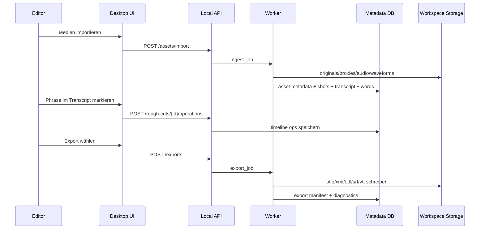
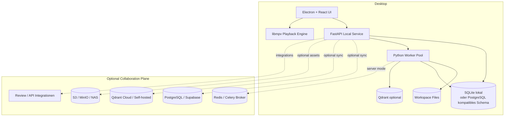
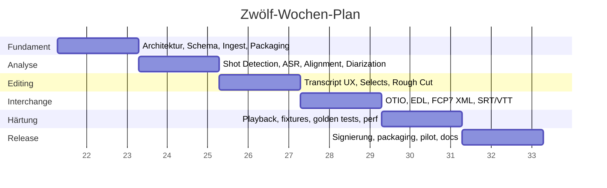

# Professionelle frame-genaue multimodale KI-Filmschnitt-Plattform

## Executive Summary

Für eine professionelle, **desktop-first**, **local-first** Filmschnitt-Plattform mit optionaler Cloud ist der beste Weg **nicht** der Versuch, sofort einen kompletten NLE-Monolithen nachzubauen. Der schnellste und zugleich belastbarste Stack ist eine **eigene Editorial- und Analyseplattform** mit vier klar getrennten Kernen: **Media I/O und Rendering** auf Basis von FFmpeg, **präziser Playback-/Scrub-Layer** via `libmpv`, **kanonisches Timeline-/Interchange-Modell** auf Basis von OpenTimelineIO, sowie ein **AI-Analyse-Stack** aus Shot-Detection, ASR, Forced Alignment und Speaker Diarization. FFmpeg ist dafür der De-facto-Medienbaukasten, `libmpv` ist offiziell als Einbettungs-Backend vorgesehen, und OTIO ist explizit für Editorial-Cut-Informationen gedacht und gerade **kein** Mediencontainer. citeturn29search1turn5search21turn15search1turn21search15

Die zentrale Produktidee sollte daher lauten: **Analyse zuerst, Schnittentscheidungen zweitens, NLE-Export drittens**. Praktisch bedeutet das: Medien ingestieren, Shot-/Scene-Candidates erkennen, Transkript auf Wortebene mit Timecodes alignen, Sprecher erkennen, semantisch indexieren, dann daraus Rough Cuts, Selects, Radio Edits und Subtitles erzeugen. Premiere Pro, DaVinci Resolve, Avid ScriptSync und Frame.io zeigen, dass transcript-first und semantic-first Workflows heute im Profimarkt real sind; Adobe betont zudem explizit, dass seine Media-Intelligence lokal auf dem Rechner läuft, ohne Upload des Materials. citeturn11search0turn14search4turn34view1turn12search16turn13search0turn13search15

Die wichtigste Architekturentscheidung ist: **intern eine eigene kanonische Timeline führen** und **Exports als separate Adapter-Schicht** behandeln. Für OTIO, EDL und FCP-7-XML ist die Lage relativ gut; für FCPXML ist die Open-Source-Landschaft nützlich, aber nicht völlig sorgenfrei, weil der `fcpx_xml`-Adapter aktuell Maintainer-Risiken hat. Für Premiere ist der belastbarste Interchange-Pfad laut OTIO-Dokumentation weiterhin **FCP 7 XML**. Deshalb sollte die Plattform intern **OTIO als Source of Truth** benutzen und Exporte gezielt validieren, statt sich früh an eine fremde XML-Dialekt-Logik zu ketten. citeturn38search6turn38search8turn38search17turn38search2turn38search9

Für eure Zielsetzung lautet die klare Empfehlung:

| Architekturentscheidung | Empfehlung | Warum |
|---|---|---|
| Desktop Shell | **Electron + React/Next UI** | Passt zu eurer bestehenden Tooling-Welt und hat einen sauberen Packaging-/Signing-/Auto-Update-Weg über Electron Forge. citeturn10search1turn10search10turn10search12turn10search19 |
| Playback | **`libmpv` primär**, WebCodecs nur ergänzend | `libmpv` ist für Embedding gedacht; WebCodecs ist mächtig, aber browserseitig noch nicht überall Baseline und deshalb alleine zu riskant für Pro-Playback. citeturn5search21turn17search12turn17search18 |
| Media Processing | **FFmpeg + ffprobe** | Industriestandard für Probe, Proxy, Audio-Extraktion, Transcoding und Export. citeturn29search1turn21search1 |
| Shot Detection | **PySceneDetect + TransNetV2 Hybrid** | Deterministisch + ML-Refinement ist belastbarer als nur Histogramme oder nur Deep Learning. citeturn4search18turn25search5turn24search2turn24search18 |
| ASR / Alignment | **faster-whisper für ASR, WhisperX für Word Alignment, pyannote für Diarization** | Starkes Verhältnis aus Geschwindigkeit, Wort-Timestamps und Sprechertrennung. WhisperX ist aber versionssensibel und sollte isoliert gepinnt laufen. citeturn15search0turn20search0turn20search1turn20search2turn24search13turn24search21 |
| Canonical Interchange | **OTIO intern** | Professionelles, editoriales Austauschmodell; Adapter-System vorhanden. citeturn15search1turn30search2turn30search10 |
| Search | **SQLite/Postgres + FTS** für MVP, **Qdrant** für semantische Suche optional | Relationale Queries und Timeline-Zustand gehören in SQL; semantische Suche kann über Qdrant später sauber ergänzt werden. citeturn32search0turn15search2turn15search10turn6search0 |
| Collaboration | **local-first default**, Cloud nur optional | Datenschutz, schnelle Iteration und weniger Ops. Gute Referenz: Adobe/Premiere arbeitet bei Media Intelligence lokal. citeturn34view1 |

**Kurzurteil:** Wenn ihr in zwölf Wochen etwas Starkes liefern wollt, dann baut **kein vollwertiges Resolve-Klon-UI**, sondern einen **AI-first Editorial Assistant mit frame-genauer Timeline**, sehr gutem Transcript-Alignment, exakten In/Outs, sauberem OTIO/EDL/XML-Export und einer starken Rough-Cut-UX. Das ist realistisch, differenzierend und technisch solide. Die größten Risiken liegen **nicht** in STT oder Shot Detection, sondern in **Frame-/Timecode-Konsistenz**, **Scrubbing/Playback**, **Interchange-Kompatibilität** und **Export-Validierung**. citeturn21search0turn38search8turn38search9turn5search21turn29search1

## Zielbild und Annahmen

Die Zielplattform ist ein **professionelles Desktop-Produkt für Editor:innen und Filmemacher:innen**, das Rohmaterial lokal analysiert, daraus schnell verwertbare Schnittentscheidungen ableitet und anschließend hochwertige Exporte in bestehende Profi-Workflows ausgibt. Die Produktlogik ist: **Footage verstehen, Schnitte vorbereiten, NLE-Interop zuverlässig machen**. Dass dies für professionelle Postproduktion relevant ist, zeigen heutige Marktwerkzeuge sehr deutlich: Premiere bietet transcript-basiertes Editieren und lokale Medienanalyse, DaVinci integriert Transkription und Kollaborationsbibliotheken, Avid positioniert ScriptSync explizit als AI-basierten Script-Editing-Beschleuniger, und Frame.io macht Transkripte sowie Entwickler-APIs zum Review- und Such-Layer. citeturn11search0turn14search4turn34view2turn12search10turn12search16turn13search0turn13search15turn14search1

Die folgenden Punkte waren nicht spezifiziert und werden deshalb als **Arbeitsannahmen** statt als erfundene Produktfakten behandelt:

| Thema | Arbeitsannahme |
|---|---|
| Zielbetriebssysteme | **macOS und Windows zuerst**, Linux später für On-Prem/Power-User |
| Frame Rates | Sequence-seitig mindestens **23.976, 24, 25, 29.97 DF/NDF, 30, 50, 59.94 DF/NDF, 60** |
| Teamgröße | Roadmap-Schätzung basiert auf **5 Personen Kernteam** |
| Einsatzmodus | **Einzelplatz lokal** zuerst, **Team Sync / Review / Shared Search** danach |
| Medienarten | Primär **dialog- und szenengetriebene Projekte**, Doku, Interview, Narrative, Social/Shorts als Nebenfall |

Als Zielgruppen solltet ihr drei Profile priorisieren. Erstens **Editor:innen im Doku-/Interview-/Narrativbereich**, die schnell Selects und Radio Edits aus viel Material bauen. Zweitens **Filmemacher:innen oder Assistenzschnitt**, die ohne komplexes NLE-Tuning erst einmal Material verstehen und vorsortieren wollen. Drittens **Post-Teams mit bestehendem Premiere-/Resolve-/Avid-Workflow**, die keine neue Timeline-Kultur lernen wollen, sondern einen starken AI-Vorlauf mit sauberem Interchange brauchen. Diese Segmentierung ist auch deshalb sinnvoll, weil transcript-first Workflows vor allem in dialoglastigem Material ihren größten Hebel haben. citeturn11search0turn13search0turn13search12

## Produktanforderungen und UX

### Priorisierter Funktionsumfang

Für das **MVP Pro** sollte der Fokus sehr scharf sein. Nicht alles, was eine klassische NLE kann, gehört in die erste Version. Was zwingend hineinmuss, ist in der folgenden Tabelle zusammengefasst.

| Bereich | MVP Pro | Später |
|---|---|---|
| Ingest | Medienimport, ffprobe-Metadaten, Timecode-Lesen, Proxy-Erstellung, Audio-Extraktion, Wellenform | Kamera-Metadaten-Mining, Batch-Ingest, Watch-Folder, Camera-to-Cloud |
| Analyse | Shot-Detection, Scene-Candidates, ASR, Word Alignment, Speaker Diarization, semantische Suche | Objekt-/Location-/Action-Erkennung, Face Clustering, Shot Type Classification |
| Schnitt | Source- und Rough-Cut-Ansicht, transcript-first trim/select/delete, clip-based timeline, frame-genaues In/Out, JKL/Scrub | Multicam, B-Roll Suggestion, beat-/emotion-aware suggestions, AI assembly |
| Text | SRT/VTT, Search/Find, transcript corrections, speaker relabeling | Übersetzung, multilingual subtitles, script import + script match |
| Export | OTIO, EDL, FCP 7 XML für Premiere, FCPXML mit Warnstatus, SRT/VTT, sidecar JSON | AAF, Resolve-native helpers, review links, direct Frame.io publish |
| Zusammenarbeit | Lokale Projekte, optional Review-Export | Shared projects, roles, comments, review threads, cloud sync |

Die Produktlinie „höchste Anforderung“ bedeutet hier konkret: **frame-accurate Schnittmarken**, **sample-accurates Audio-Alignment**, **deterministische Exporte**, **reproduzierbare Analysen**, **saubere Projektmigration**, **robustes Local-First-Verhalten**, **keine Hidden Cloud-Abhängigkeit**. Adobe zeigt für lokale AI-Analyse bereits das gewünschte UX-Muster: Analyse läuft im Hintergrund und priorisiert Playback, statt den Editing-Flow zu blockieren. Genau dieses Verhalten sollte euer Nordstern sein. citeturn34view2

### Nichtfunktionale Anforderungen

Die nichtfunktionalen Anforderungen sind für dieses Produkt fast wichtiger als die Featureliste, weil sie darüber entscheiden, ob das System wie ein Tool oder wie ein Spielzeug wirkt.

| Kategorie | Zielwert |
|---|---|
| Timeline-Präzision | Alle Edits intern als **Ganzzahl-Frames** relativ zur Sequence speichern |
| Audio-Präzision | Alignment intern zusätzlich in **Samples** speichern |
| UI-Reaktivität | Projekt öffnen unter 5 s bei lokalem Cache; Sucheingaben unter 150 ms Echo |
| Playback | Scrub-Start unter 100 ms aus Proxy-Cache; Sprung auf beliebigen Cut unter 300 ms |
| Analyse-Idempotenz | Gleicher Input + gleiche Pipeline-Version ergibt gleichen Analysezustand |
| Offline-Fähigkeit | Voller Ingest-, Analyse-, Rough-Cut- und Export-Pfad ohne Internet |
| Interchange | Round-trip-Tests für OTIO, EDL, XML gegen Golden Fixtures |
| Auditierbarkeit | Jede Analyse und jeder Export versioniert, reproduzierbar, mit Provenance |

### UX-Flow für Analyse, Rough Cut und Export

Der wichtigste UX-Flow sollte nicht „Timeline zuerst“ sein, sondern **Material verstehen → Selects treffen → Timeline bestätigen → Exportieren**. Das ist nahe an Premiere Text-Based Editing, Avid ScriptSync und modernen Review-Tools, aber auf euren lokalen Profi-Use-Case zugeschnitten. citeturn11search0turn13search0turn13search15

```mermaid
flowchart LR
    A[Medien importieren] --> B[Probe + Proxy + Waveform]
    B --> C[Shot Detection]
    C --> D[ASR + Word Alignment]
    D --> E[Speaker Diarization]
    E --> F[Semantischer Index]
    F --> G[Transcript-first Analyse View]
    G --> H[Selects und Rough Cut]
    H --> I[Timeline Fine Cut]
    I --> J[Export OTIO XML EDL SRT VTT]
```



Im **Analyse-Flow** landet der User in einer Source-Ansicht mit Video, Audio-Wellenform, erkannten Shots, Wort-Transkript, Sprecherlabels und Suchfeld. Einzelne Wörter, Phrasen oder ganze Sprecherblöcke lassen sich markieren und als Selects in einen Rough-Cut-Container schicken. Im **Rough-Cut-Flow** sieht der User links das Transcript und rechts eine reduzierte Timeline. Jede Textoperation erzeugt eine echte Schnittänderung auf der Timeline. Im **Export-Flow** wählt der User Zielsystem, Sequence-FPS, Audio-Stems, Captions und Review-Artefakte aus; das System validiert dabei vor dem Schreiben, ob der Exportpfad Features verlieren würde, etwa bei EDL oder instabilen FCPXML-Sonderfällen. Dass EDL strukturell limitiert ist und OTIO/Plugin-Adapter unterschiedliche Fähigkeiten haben, ist dokumentiert; deshalb braucht der Exportdialog unbedingt ein belastbares Capability-/Degradation-Modell. citeturn38search8turn38search6turn38search9



## Architektur und Datenmodell

### Referenzarchitektur

Die sinnvollste Referenzarchitektur ist **doppelt geschichtet**: ein **Local Runtime Plane** für alles, was auf dem Schnittrechner laufen muss, und ein **Optional Collaboration Plane** für Team-Features, Review oder zentrale Suche. So bleibt das Produkt offline nutzbar, kann später aber On-Prem oder Cloud-fähig werden. FFmpeg/ffprobe übernehmen Mediaprobe, Proxying und Export; `libmpv` übernimmt verlässliches Playback; FastAPI stellt die lokale Service- und Integrationskante; die Heavy-Lifts laufen in Python-Workern; OTIO bleibt das kanonische Interchange-Modell. citeturn29search1turn21search1turn5search21turn10search8turn15search1



Warum **nicht** direkt MLT oder GStreamer Editing Services als Kern? Beide sind legitime Multimedia-Editing-Frameworks; MLT treibt u. a. Kdenlive und Shotcut, GES ist explizit für NLE-orientierte Anwendungen gedacht. Für euren Use-Case erzeugen sie aber früh sehr viel Komplexität im eigentlichen Timeline-/Render-Modell, bevor ihr euren AI-Mehrwert überhaupt ausgeliefert habt. Für einen AI-first Editorial Assistant mit starkem Export-Interchange ist ein **eigener Timeline-Kern + OTIO + FFmpeg/libmpv** meist der schnellere Weg. Sobald ihr später volles NLE-Authoring, komplexes Compositing und Effektgraphen braucht, kann MLT/GES erneut evaluiert werden. citeturn5search1turn5search2turn22search1turn22search8turn27search0

### Frame-aware Timecode-Modell

Hier sollte kompromisslos gearbeitet werden. Das Modell braucht **drei Zeitdomänen gleichzeitig**:

1. **Sequence Time**: ganzzahlige Frames relativ zur Sequenz.
2. **Source Media Time**: Quelldomänen-Timestamps relativ zum Originalclip.
3. **Audio Sample Time**: sample-genaue Audiopositionen für exaktes Alignment.

OTIO nutzt dafür ein RationalTime-Modell aus `value/rate`, das sich sauber reskalieren lässt. Genau das Prinzip solltet ihr intern übernehmen, aber noch härter auf Sample-Genauigkeit zuspitzen. Drop-Frame betrifft **die Nummerierung**, nicht die physische Frame-Dauer; bei 29.97 DF müssen daher Anzeige und interne Berechnung getrennt sein. ffprobe ist die richtige Quelle für stream- und containerseitige Metadaten, inklusive Timecode-Feldern, während OTIO die saubere Repräsentation für Editorial-Ranges liefert. citeturn21search0turn21search1turn21search14

**Empfohlenes Modell**

```text
FramePoint
- frame_index: bigint             // absolute frame on sequence
- rate_num: int                   // e.g. 30000
- rate_den: int                   // e.g. 1001
- drop_frame: bool

AudioPoint
- sample_index: bigint
- sample_rate: int                // e.g. 48000

MediaRange
- src_in_frame: bigint
- src_out_frame_exclusive: bigint
- seq_in_frame: bigint
- seq_out_frame_exclusive: bigint
- src_timecode_start: string|null
- src_rate_num: int
- src_rate_den: int
- speed_num: int
- speed_den: int
```

**Konsequenzen für die Implementierung**

| Regel | Entscheidung |
|---|---|
| Timeline-Edits | Immer in **Frames** speichern |
| Transcript-Alignment | Wortgrenzen in **Samples** speichern, für UI auf Frames projizieren |
| UI-Anzeige | DF/NDF streng als Anzeigeformat behandeln |
| VFR-Material | Für Editorial **CFR-Proxies** erzeugen, source mapping separat behalten |
| Range-Enden | Konsequent **end-exclusive** speichern |
| Export | Adapter bekommt **kanonische Ranges**, nicht UI-Zustände |

### Datenmodell und Schemas

Für das lokale Produkt reicht technisch SQLite als Runtime-Store. Das logische Datenmodell sollte aber **PostgreSQL-kompatibel** sein, damit On-Prem und Cloud keinen Re-Write erzwingen. Der folgende Schema-Schnitt ist für MVP Pro ausreichend.

#### Kernobjekte

| Tabelle | Schlüsselspalten | Wichtige Felder | Zweck |
|---|---|---|---|
| `projects` | `id` | `name`, `sequence_rate_num`, `sequence_rate_den`, `drop_frame`, `workspace_root`, `created_at` | Projekt-Container |
| `media_assets` | `id`, `project_id` | `type`, `display_name`, `source_path`, `sha256`, `duration_frames`, `audio_sample_rate`, `start_timecode`, `width`, `height`, `codec_video`, `codec_audio` | Canonical Asset Registry |
| `asset_files` | `id`, `asset_id` | `kind`, `path`, `size_bytes`, `is_proxy`, `is_waveform`, `is_audio_extract`, `checksum` | Originale, Proxies, Wellenformen, Extracts |
| `analysis_runs` | `id`, `asset_id` | `pipeline_version`, `status`, `started_at`, `finished_at`, `config_json`, `diagnostics_json` | Reproduzierbare Analyseinstanzen |
| `shots` | `id`, `asset_id`, `analysis_run_id` | `src_in_frame`, `src_out_frame_exclusive`, `confidence`, `method`, `thumbnail_path` | Shot-/Cut-Kandidaten |
| `speakers` | `id`, `asset_id`, `analysis_run_id` | `label`, `display_name`, `color`, `confidence` | Speaker-Registry |
| `transcript_segments` | `id`, `asset_id`, `analysis_run_id` | `speaker_id`, `start_sample`, `end_sample`, `start_frame`, `end_frame`, `text`, `confidence` | Segmentebene |
| `transcript_words` | `id`, `segment_id` | `idx`, `start_sample`, `end_sample`, `start_frame`, `end_frame`, `text`, `confidence`, `is_punctuation` | Wortebene für frame-/sample-aware Edit |
| `timelines` | `id`, `project_id` | `name`, `kind`, `otio_json`, `created_from` | Rough-Cut, Selects, Final Timeline |
| `timeline_clips` | `id`, `timeline_id` | `asset_id`, `src_in_frame`, `src_out_frame_exclusive`, `seq_in_frame`, `seq_out_frame_exclusive`, `lane`, `linked_audio_group`, `speaker_id`, `origin_word_start_id`, `origin_word_end_id` | Timeline Items |
| `exports` | `id`, `timeline_id` | `format`, `status`, `output_path`, `options_json`, `diagnostics_json`, `created_at` | Export-Historie |
| `jobs` | `id` | `queue`, `kind`, `payload_json`, `status`, `attempt`, `lease_expires_at`, `worker_id`, `result_ref`, `error_json` | Queue-/Worker-Steuerung |

#### Optionale Such- und Kollaborationsobjekte

| Tabelle | Felder | Zweck |
|---|---|---|
| `embeddings` | `object_type`, `object_id`, `vector_ref`, `text`, `model`, `lang` | Semantische Suche |
| `review_comments` | `timeline_id`, `frame_in`, `frame_out`, `author_id`, `body` | Optionales Review |
| `sync_events` | `entity_type`, `entity_id`, `op`, `payload_json`, `synced_at` | Optionaler Cloud-Sync |

### API-Oberfläche

Die API sollte klein, explizit und workflow-orientiert bleiben. Keine generischen „do everything“-Endpoints.

| Bereich | Endpoint | Zweck |
|---|---|---|
| Projekte | `POST /projects` | Projekt anlegen |
| Projekte | `GET /projects/{id}` | Projekt lesen |
| Assets | `POST /projects/{id}/assets/import` | Medien ingestieren |
| Assets | `GET /assets/{id}` | Asset-Metadaten |
| Assets | `POST /assets/{id}/proxies` | Proxy-Erzeugung |
| Analyse | `POST /assets/{id}/analysis` | Analysejob starten |
| Analyse | `GET /assets/{id}/analysis/latest` | Letzten Analysezustand holen |
| Shots | `GET /assets/{id}/shots` | Shot-Liste |
| Transcript | `GET /assets/{id}/transcript` | Segmente + Wörter |
| Transcript | `PATCH /transcript/segments/{id}` | Speaker/Text korrigieren |
| Rough Cut | `POST /projects/{id}/timelines` | Rough-Cut/Timeline anlegen |
| Rough Cut | `POST /timelines/{id}/operations` | Insert/delete/lift/ripple ops |
| Rough Cut | `GET /timelines/{id}` | Timeline lesen |
| Suche | `POST /search` | Lexikalische + semantische Suche |
| Export | `POST /timelines/{id}/exports` | Export starten |
| Export | `GET /exports/{id}` | Status + Diagnostics |
| Jobs | `GET /jobs/{id}` | Jobstatus |
| Integrationen | `POST /integrations/frameio/publish` | Optionales Publish |
| Interchange | `POST /interop/validate` | OTIO/XML/EDL Preflight |

### Worker-Pipeline und Queue-Modell

Die Pipeline sollte aus **kleinen, idempotenten Stufen** bestehen. FastAPI-eigene Background Tasks sind dafür allein zu leichtgewichtig; sie sind okay für Kleinkram, aber nicht für stabile Heavy Jobs. Für Server-Betrieb ist Celery mit Queue-Routing brauchbar, weil verschiedene Queues sauber an CPU-/GPU-Worker geroutet werden können. Für die Desktop-Variante würde ich jedoch **keine vollwertige Broker-Pflicht** erzwingen, sondern einen DB-basierten lokalen Jobrunner verwenden, der später auf Celery/Redis umgeschaltet werden kann. Celery dokumentiert Queue-Routing explizit; OTel hat offizielle Instrumentierung für FastAPI und Celery. citeturn10search2turn18search3turn19search0turn19search1

**Empfohlenes Logikmodell**

| Queue | Typ | Priorität | Worker |
|---|---|---|---|
| `ingest.io` | Probe, Checksums, Poster Frames | hoch | CPU |
| `proxy.cpu` | Proxying, audio extract, waveform | mittel | CPU |
| `analysis.scene` | Shot detection | hoch | CPU/GPU optional |
| `analysis.asr` | Transkription | hoch | GPU bevorzugt |
| `analysis.align` | Forced alignment | hoch | CPU/GPU |
| `analysis.diarize` | Sprechertrennung | mittel | GPU bevorzugt |
| `analysis.embed` | Embeddings | niedrig | CPU/GPU |
| `export.interchange` | OTIO, XML, EDL, captions | hoch | CPU |
| `maintenance.gc` | Cache, cleanup, compaction | niedrig | CPU |

**Job-Lebenszyklus**

`queued -> leased -> running -> succeeded | failed | canceled`

Jeder Job braucht `attempt`, `max_attempts`, `lease_expires_at`, `heartbeat_at`, `caused_by_job_id`, `pipeline_version` und `idempotency_key`. Damit lassen sich Desktop-Abstürze, Worker-Neustarts und Doppelausführung sauber beherrschen.

### Storage-Layout

Der Storage muss für lokale Verstehbarkeit, Backup und optionale Cloud-Synchronisierung strukturiert bleiben.

```text
workspace/
  project-{project_id}/
    originals/
      {asset_id}/source.ext
    proxies/
      {asset_id}/proxy-1080p-intra.mov
    audio/
      {asset_id}/mono-16k.wav
      {asset_id}/mix-48k.wav
    waveforms/
      {asset_id}/waveform.json
      {asset_id}/peaks.bin
    analysis/
      {asset_id}/
        manifest.json
        shots.json
        scenes.json
        transcript.segments.json
        transcript.words.json
        speakers.json
        embeddings.json
        thumbnails/
    timelines/
      {timeline_id}.otio.json
      {timeline_id}.cache.json
    exports/
      {export_id}/
        timeline.otio
        timeline.fcpxml
        timeline.fcp7.xml
        timeline.edl
        captions.srt
        captions.vtt
        diagnostics.json
    cache/
      decode/
      thumbnails/
      search/
```

Dieses Layout passt gut zu OTIO als Timeline-Truth, zu S3/MinIO/NAS als optionalem Objektstore und zu lokalen Sidecar-/Cache-Dateien. Premiere nutzt für lokale Medienanalyse ebenfalls Sidecar-/Cache-Artefakte und betont, dass Analyse und Search lokal bleiben; das ist ein sehr gutes Vorbild für euren Storage-Charakter. citeturn34view2turn34view1

## Integrationen und Komponentenlandschaft

### Exportformate und Interchange-Strategie

Die Exportstrategie muss als eigener Produktbereich betrachtet werden. Empfehlung:

| Format | Rolle | Status | Wichtige Hinweise |
|---|---|---|---|
| **OTIO** | Kanonisches internes und externes Austauschformat | **Pflicht** | Sauber für Editorial-Cut-Daten, nicht für Media-Containment. citeturn15search1turn21search15 |
| **EDL / CMX3600** | Minimal robuster Universalaustausch | **Pflicht** | Gut für lineare Cuts, aber strukturell limitiert. Supported via `cmx_3600`. citeturn38search8turn38search6 |
| **FCP 7 XML** | Premiere-/Legacy-Interop | **Pflicht** | Laut OTIO der empfohlene Adobe-Interchange-Pfad. `fcp_xml` lesen/schreiben. citeturn38search8turn38search17 |
| **FCPXML** | Final Cut Pro Interop | **Wichtig, aber vorsichtig** | `fcpx_xml` existiert, ist aber derzeit kein risikofreier Pfad; eigene Golden Tests nötig. citeturn38search2turn38search9 |
| **SRT** | Universelle Subtitle-Ausgabe | **Pflicht** | Plain-text, extrem breit unterstützt. citeturn37search0 |
| **VTT** | Web-/Review-Subtitle-Ausgabe | **Pflicht** | W3C-Standard für timed text im Web. citeturn37search1 |

**Wichtige Produktentscheidung:** Intern **niemals EDL oder XML als Projektzustand** verwenden. Alles zuerst in OTIO/kanonischem Modell halten, Exporte nur generieren.

### Vergleich relevanter Open-Source-Komponenten

Die Tabelle unten ist als konkrete Mapping-Liste für euren Stack gedacht. **Maturity** ist eine Architektur-Einschätzung aus Release-/Dokumentationslage und Integrationsrisiko.

| Komponente | Projekt | Repo/URL | Lizenz | Maturity | Stärken | Grenzen | Integrationshinweis | Empfohlene Rolle |
|---|---|---|---|---|---|---|---|---|
| Media I/O | FFmpeg | `ffmpeg.org` / `github.com/FFmpeg/FFmpeg` | LGPL 2.1+ / optional GPL | Hoch | Universeller Probe-/Transcode-/Filter-Stack | Lizenz- und Build-Konfiguration genau beachten | LGPL-konforme Builds bevorzugen; getrennte Export-Profile führen. citeturn29search0turn29search1turn29search3 | **Pflichtkern** |
| Media Probe | ffprobe | `ffmpeg.org/ffprobe.html` | Teil von FFmpeg | Hoch | Maschinenlesbare Stream-/Container-Metadaten | Kein Timeline-Modell | Direkt in Ingest-Pipeline und Validierung nutzen. citeturn21search1 | **Pflichtkern** |
| Playback | mpv / libmpv | `mpv.io` / `github.com/mpv-player/mpv` | LGPL 2.1+ / gemischt | Hoch | Einbettbares, robustes Video-/Audio-Backend | Native Integration in Electron kostet Arbeit | Nicht Browser-Video als Primärplayer nehmen. citeturn5search21turn5search0turn26search12 | **Primärer Playback-Layer** |
| Shot Detection | PySceneDetect | `github.com/Breakthrough/PySceneDetect` | BSD-3-Clause | Hoch | Deterministisch, simpel, gute Python-API | Erkennt primär Shots, nicht echte semantische Szenen | Perfekt als erste Cut-Pass-Erkennung. citeturn25search0turn25search5turn25search19 | **Pflicht für MVP** |
| Shot Refinement | TransNetV2 | `github.com/soCzech/TransNetV2` | MIT | Mittel | Moderne Deep-Learning-Shot-Grenzen | Extra Modellpflege, weniger „drop-in“ | Als zweiter Pass nur für strittige Grenzfälle nutzen. citeturn24search2turn24search6turn24search18 | **Optionaler Quality Booster** |
| ASR Engine | faster-whisper | `github.com/SYSTRAN/faster-whisper` | MIT | Hoch | Sehr schnell, weniger Speicher, quantisierbar | Kein kompletter Editorial-Layer allein | Für rohe ASR und GPU/CPU-Fallback nutzen. citeturn15search0turn15search12turn20search0 | **Empfohlener ASR-Kern** |
| Forced Alignment | WhisperX | `github.com/m-bain/whisperX` | BSD-2-Clause | Mittel | Wort-Timestamps, Alignment, Diarization-Flow | Dependency-/Version-Churn | Isolierte Runtime mit hart gepinnten Versionen. citeturn20search1turn24search17turn24search13turn24search21 | **Empfohlener Alignment-Layer** |
| Speaker Diarization | pyannote.audio | `github.com/pyannote/pyannote-audio` | MIT | Hoch | State-of-the-art Open-Source-Diarization | Modell-/Token-Handling beachten | Separaten Worker und Cache einplanen. citeturn20search2turn20search8 | **Empfohlener Diarization-Layer** |
| Timeline Interchange | OpenTimelineIO | `github.com/AcademySoftwareFoundation/OpenTimelineIO` | Apache-2.0 | Hoch | Editorial-Cut-API und Interchange-Standard | Kein Media-Container, Adapterqualität variiert | Internes Canonical Model daran anlehnen. citeturn15search1turn30search1turn30search2 | **Pflichtkern** |
| OTIO Plugins | OpenTimelineIO-Plugins | `github.com/OpenTimelineIO/OpenTimelineIO-Plugins` | Apache-2.0 | Mittel | Liefert `cmx_3600`, `fcp_xml`, `fcpx_xml` u. a. | Community-supported Plugins, nicht alle gleich stabil | Per Export-Matrix und Golden Tests absichern. citeturn15search5turn38search6turn38search12 | **Pflicht für Export** |
| FCPXML Adapter | `otio-fcpx-xml-adapter` | `github.com/OpenTimelineIO/otio-fcpx-xml-adapter` | Apache-2.0 | Mittel-niedrig | Liest/schreibt FCPXML | Maintainer- und Usability-Risiko | Nur mit Warnstatus und Fixture-Testbank. citeturn38search2turn38search9 | **Später / guarded** |
| Desktop Packaging | Electron Forge | `electronforge.io` / `github.com/electron/forge` | MIT | Hoch | Packaging, Signing, Publishing | App-Größe und Native-Bindings | Passt sehr gut zu Electron-Desktop-Distribution. citeturn10search1turn10search7turn10search22 | **Empfohlen** |
| Local Security | Electron safeStorage | `electronjs.org/docs/latest/api/safe-storage` | Electron-Projekt | Hoch | Nutzt OS-Krypto | Keine vollständige App-Security-Lösung | Nur für Secrets, nicht als Allheilmittel. citeturn23search0turn23search2turn23search4 | **Pflicht für Secrets** |
| Relationale DB | PostgreSQL | `postgresql.org` | PostgreSQL License | Hoch | Reif, permissiv, sauber für server mode | Embedded lokal schwerer als SQLite | Kanonisches Server-Schema darauf auslegen. citeturn32search0turn32search3 | **Server-Schema-Basis** |
| Vector Search | Qdrant | `qdrant.tech` / `github.com/qdrant/qdrant` | Apache-2.0 | Hoch | Self-hosted/Cloud, API Keys, Snapshots | Für MVP nicht zwingend nötig | Erst ab semantischer Suche/Teammodus zuschalten. citeturn15search2turn6search0turn6search6 | **Optional ab Phase 2** |
| Queue | Celery | `docs.celeryq.dev` | BSD | Hoch | Queue-Routing, Retries, Worker-Ökosystem | Für Desktop als Pflichtbroker zu schwer | Nur für Server-/On-Prem-Modus verpflichtend. citeturn18search0turn18search3 | **Server-Queue** |
| Queue Light | RQ | `python-rq.org` / `github.com/rq/rq` | BSD | Mittel-hoch | Simpler Einstieg, Redis-basiert | Weniger Workflow-Mächtigkeit | Für kleine interne Services okay, aber nicht mein erster Pick für komplexe Pipelines. citeturn18search1turn18search4 | **Alternative** |
| Referenzprodukt | CutScript | `github.com/DataAnts-AI/CutScript` | MIT | Mittel | Sehr nah an eurem Zielstack: Electron + React + FastAPI + WhisperX + FFmpeg | Noch kein „Pro editorial backbone“ | Gute Referenz für Packaging und Transkript-UX, nicht als Core-Dependency. citeturn16search0turn28search0 | **Referenzprojekt** |
| Referenzprodukt | StoryToolkitAI | `github.com/octimot/StoryToolkitAI` | GPL-3.0 laut Repo-Hinweis nicht verifiziert hier; prüfen | Mittel | Film-Editing-AI, Suche, EDL/XML-Export | Lizenz und Architektur vor Nutzung separat prüfen | Sehr gute Produktreferenz, aber eher Inspirationsquelle als embedded Komponente. citeturn22search6turn22search15 | **Produktreferenz** |
| Optionaler Apple-Special-Path | MLX Whisper | `github.com/ml-explore/mlx-examples` | MIT | Mittel | Apple-Silicon-optimierter Whisper-Pfad | Eigene macOS-Sonderlogik nötig | Nur für Mac-Builds als Turbo-Pfad einbauen. citeturn35search1turn36search0turn36search1 | **macOS-Optimierung** |

### Vergleich relevanter Enterprise- und kommerzieller Komponenten

| Komponente | Produkt | Repo/URL | Lizenz | Maturity | Stärken | Grenzen | Integrationshinweis | Empfohlene Rolle |
|---|---|---|---|---|---|---|---|---|
| Text-based Editing Benchmark | Adobe Premiere Pro | `adobe.com/premiere` / `helpx.adobe.com/.../text-based-editing` | Proprietär | Hoch | Transcript-first Editing, Timecode-Metadaten, lokale Media-Intelligence, Caption-Übersetzung | Kein lokaler OSS-Baustein, geschlossen | Beste UX-Benchmark für Rough-Cut-Flow und lokale Analyse. citeturn11search0turn14search4turn14search9turn34view1turn34view2 | **Benchmark / Interop-Ziel** |
| All-in-one Post Benchmark | DaVinci Resolve | `blackmagicdesign.com/products/davinciresolve` | Proprietär | Hoch | Editing, Farbe, Audio, Kollaboration, Auto-Transcription/Subtitles | Geschlossen, plugin-/API-begrenzt | Sehr guter Vergleichsmaßstab für Pro-Workflows. citeturn12search16turn12search10 | **Benchmark / Export-Ziel** |
| Script Editing Benchmark | Avid ScriptSync | `avid.com/products/media-composer-scriptsync-option` | Proprietär | Hoch | Script/Dialog-Sync für Edit-Workflows | Avid-Ökosystemgebunden | Konzeptioneller Benchmark für script-/transcript-linked editing. citeturn13search0turn13search2 | **Benchmark** |
| Review & API | Frame.io | `developer.adobe.com/frameio` / `frame.io` | Proprietär | Hoch | Searchable transcripts, review, API, publish workflows | Nicht local-first | Optionales Review-/Delivery-Ziel. citeturn13search15turn14search1turn14search16 | **Optionaler Integrationspartner** |
| ASR API | Google Speech-to-Text | `cloud.google.com/speech-to-text` | Proprietär Service | Hoch | Word offsets | Zeitauflösung API-seitig gröber, Cloud-only | Nur optionaler Cloud-Fallback, nicht euer Kern. citeturn9search1turn9search5turn9search9 | **Fallback** |
| ASR API | Amazon Transcribe | `aws.amazon.com/transcribe` | Proprietär Service | Hoch | Word-Timestamps, Diarization | Cloud-only | Eher für Managed/Enterprise-Varianten. citeturn9search2turn9search10turn9search13 | **Fallback** |
| Video Analysis API | Azure AI Video Indexer | `learn.microsoft.com/azure/azure-video-indexer` | Proprietär Service | Hoch | Video+Audio Insights, cloud und edge Positionierung | Cloud-/Azure-Frame | Interessant für Enterprise Add-ons, nicht für local-first Kern. citeturn9search0turn9search4turn9search14 | **Enterprise Add-on** |
| Vector DB Managed | Qdrant Cloud | `qdrant.tech/pricing` | Managed kommerziell | Mittel-hoch | Free tier, Hybrid/Private Cloud, API/Terraform/Pulumi | Zusätzliche Ops-/Kostenebene | Sauberer Pfad für späteren Teambetrieb. citeturn33view0 | **Später** |

## Betrieb, Sicherheit und Qualität

### Deployment-Optionen

Für **lokalen Desktop-Betrieb** sollte das Produkt als Electron-App mit gebündelter Python-Runtime, FFmpeg und `libmpv` ausgeliefert werden. Electron Forge deckt Packaging, Installer, Signierung und Publishing ab; Electron dokumentiert Code Signing, und für macOS ist Notarisierung praktisch Pflicht. citeturn10search1turn10search10turn10search12turn10search19

Für **On-Prem** ist die beste Zielarchitektur: API, Worker, PostgreSQL, Redis und Qdrant in Containern, Storage auf MinIO/NAS. Für **Cloud** ist die sauberste Variante: lokale Desktop-App als Kontrollzentrum, optional synchronisierende API mit Managed Postgres/Auth, Qdrant Cloud und Objektstorage. Qdrant bietet dafür Managed-, Hybrid- und Private-Cloud-Modelle; Supabase ist self-hostbar, weist aber selbst darauf hin, dass self-hosted nicht alle Plattformfeatures der gehosteten Variante enthält. citeturn33view0turn32search1turn32search16

### Sicherheit und Datenschutz

Local-first ist hier nicht nur ein Marketing-Satz, sondern ein entscheidender Architekturwert. Adobe positioniert seine lokale Media-Intelligence ausdrücklich so, dass Footage, Analyse und Suchanfragen den Rechner nicht verlassen; genau diese Datenschutzlinie ist für eure Produktpositionierung ideal. citeturn34view1turn34view2

Für Secrets auf dem Desktop sollte **Electron `safeStorage`** verwendet werden, das OS-seitige Kryptosysteme nutzt. Auf Windows baut das auf DPAPI-Prinzipien auf; auf macOS ist die Keychain der richtige Secret-Speicher. Für Cloud-/Team-Betrieb sind **RLS in Supabase/Postgres** und **API-Key-Schutz in Qdrant** die naheliegenden Controls. Qdrant dokumentiert Auth-Niveaus und Verschlüsselungsoptionen; Supabase dokumentiert RLS explizit als Kernmechanismus für Browser-nahe Datenzugriffe. citeturn23search0turn23search2turn23search4turn6search1turn6search10turn6search0turn33view0

**Empfohlenes Sicherheitsmodell**

| Ebene | Empfehlung |
|---|---|
| Desktop-Secrets | `safeStorage` + OS-Keychain/DPAPI |
| Workspace-Schutz | Projektlokale Verschlüsselung optional, aber Secrets getrennt halten |
| Cloud-Zugriff | Project-scoped Access Tokens, kurze TTL, explizite Device Linking |
| Team-Modus | Rollen: `owner`, `editor`, `reviewer`, `exporter`, `admin` |
| Storage | Signed URLs für Objektzugriff, nie rohe Bucket Credentials im Client |
| Audit | Export- und Analyse-Aktivitäten mit Provenance loggen |

### Performance-Ziele und Hardware-Empfehlungen

Die Hardwareempfehlung muss zur Realität moderner Speech-/Diarization-Workloads passen. Für Cloud-Inferenz sind L4-, A10- und L40S-Klassen heute ein sinnvoller Referenzrahmen; AWS G6 setzt auf NVIDIA L4, G6e auf L40S, Azure NVadsA10 v5 auf A10, Google Cloud Run bietet L4 auch serverless an und nennt dafür einen Sekundenpreis. MLX macht für Apple Silicon einen speziellen lokalen Pfad attraktiv. citeturn8search6turn8search0turn8search5turn8search7turn8search10turn36search2turn36search10

**Empfohlene Zielklassen**

| Klasse | Mindestempfehlung | Produktionsempfehlung |
|---|---|---|
| Laptop lokal | 8 CPU-Cores, 32 GB RAM, 1 TB NVMe, Apple M3 Pro oder RTX 4060 8 GB | 12+ CPU-Cores, 48–64 GB RAM, 2 TB NVMe, Apple M4 Max oder RTX 4070/4080 |
| Desktop lokal | 12 CPU-Cores, 64 GB RAM, 2 TB NVMe, RTX 4070 12 GB | 16+ CPU-Cores, 128 GB RAM, 4 TB NVMe, RTX 4080/4090 oder L4/A10-Class |
| Server On-Prem | 16–24 CPU-Cores, 128 GB RAM, 8 TB NVMe, 1× A10/L4 | 32 CPU-Cores, 256 GB RAM, 16 TB NVMe, 1–2× L40S |
| Cloud | L4/A10 für Analyse, CPU-Pool für Probe/Export | L40S für Batch- und Hochdurchsatz-Analyse |

**Pragmatische Performance-Ziele**

| Workload | Ziel |
|---|---|
| Ingest + Probe pro Clip | unter 5 s für Metadaten |
| Waveform aus 60 min Audio | unter 20 s |
| Shot Detection auf Proxy | kleiner als 0,25× Clipdauer |
| ASR + Alignment 60 min | kleiner als 1× Realtime auf Produktions-GPU |
| Timeline-Suche | unter 150 ms UI-Feedback |
| Export OTIO/EDL/SRT/VTT | unter 5 s für typische Projekte |
| XML-Export | unter 20 s inkl. Preflight |

Diese Werte sind bewusst als **Produktziele** formuliert, nicht als bereits gemessene Zusagen.

### Teststrategie und Observability

Dieses Produkt braucht drei Testschichten: **Medien-/Fixture-Tests**, **Zeitmodell-Tests** und **Interop-/Golden-Tests**. Gerade der Zeitmodell-Teil muss hart getestet werden: Frame-Raten, DF/NDF-Konvertierung, end-exclusive Ranges, Speed Changes, Sample-zu-Frame-Projektionen, XML-Roundtrips. OTIO und FFprobe sind hier die richtigen Referenzbausteine, aber ihr müsst eure eigene Golden-Corpus-Strategie aufbauen. citeturn21search0turn21search1turn38search8

**Empfohlene Testpyramide**

| Testart | Beispiele |
|---|---|
| Unit | Timecode/DF/NDF, Range-Math, word-to-frame snapping |
| Integration | ffprobe ingest, proxy pipeline, ASR→alignment→diarization |
| Golden Export | OTIO, EDL, FCP 7 XML, FCPXML, SRT, VTT gegen Fixture-Sets |
| UX Regression | Transcript operations erzeugen exakt erwartete Timeline-Deltas |
| Performance | Analysegeschwindigkeit, Queue-Latenzen, RAM/VRAM-Budgets |
| Chaos/Recovery | Worker-Absturz, halbe Exporte, Session-Reopen, Medienpfad geändert |

Für Observability würde ich OpenTelemetry für API und Queue sowie Prometheus-Metriken für Worker/Queue/GPU nutzen. Offizielle Instrumentierung für FastAPI und Celery ist da, ebenso der offizielle Prometheus-Python-Client. citeturn19search0turn19search1turn19search2turn19search3

**Wichtige Metriken**

| Kategorie | Metriken |
|---|---|
| API | Request-Latenz, Fehlerquote, Queue-Enqueue-Zeit |
| Worker | Joblaufzeit, Retries, Failures, Lease Timeouts |
| AI | ASR X realtime, diarization latency, alignment failures |
| Media | Proxy throughput, waveform throughput, export throughput |
| UX | search-to-highlight, jump-to-frame, playback stall count |
| Infra | CPU, RAM, VRAM, Disk I/O, queue depth |

### Grobe Kostenabschätzung

Bei einem local-first Desktop-Produkt verschiebt sich der Kostenblock stark von „Infra“ zu **Entwicklung und QA mit realem Medienkorpus**. Der wahre Kostentreiber ist nicht GPU-Compute allein, sondern das Stabilisieren von Playback, Timecode, Export und Edge Cases.

**Entwicklungsaufwand grob**

| Teamrolle | Anteil |
|---|---|
| Product/Tech Lead | 0,5–1 FTE |
| Desktop/UI | 1,5 FTE |
| Backend/Workers | 1,5 FTE |
| Media/Interop | 1 FTE |
| QA/Test Automation | 0,5–1 FTE |

Für einen brauchbaren **MVP Pro in 12 Wochen** würde ich mit **55–75 Person-Wochen** rechnen. Ein „wirklich produktionsharter“ Release-Stand mit breiter XML-/EDL-Testbank, Kollaboration und mehrsprachiger Analyse liegt eher bei **90–130 Person-Wochen**.

**Infra grob**

| Szenario | Größenordnung |
|---|---|
| Rein lokal, Einzelplatz | praktisch keine laufenden Serverkosten |
| Lokales Backup in Objektstorage | S3 Standard liegt offiziell bei **0,023 USD/GB-Monat**, also grob **23 USD/TB-Monat**. citeturn7search3 |
| Semantische Suche managed | Qdrant Free Tier: **1 GB RAM / 4 GB Disk**, danach usage-based. citeturn33view0 |
| Serverless GPU-Analyse klein | Google Cloud Run L4 nennt **0,0001867 USD/s**, also rund **0,67 USD/h** GPU-only. citeturn8search7 |
| Kleine Pilot-Cloud | realistisch **100–400 USD/Monat** ohne große Transcoding-Last |
| On-Prem Workstation | grob **4.000–8.000 EUR** einmalig pro starke Analyse-/Editor-Maschine, als Architekturschätzung |

## Roadmap und Aufwand

Die folgende 12-Wochen-Planung ist absichtlich **hart fokussiert**. Ziel ist nicht „alles“, sondern eine **starke, beeindruckende Pro-Version**, die Engineers und PMs sofort bauen können.



### Phasenplan

| Phase | Fokus | Meilensteine | Deliverables | Geschätzte Person-Wochen |
|---|---|---|---|---|
| Woche eins bis zwei | Foundations | Laufende Desktop-App, lokaler Service, Workspace-Struktur, Ingest-Pipeline | Electron Shell, FastAPI Service, ffprobe ingest, Proxy/Waveform Jobs, Schema v1 | 10–12 PW |
| Woche drei bis vier | Analysekern | Shots, ASR, Wort-Alignment, Sprecher | PySceneDetect/TransNetV2 Pass, faster-whisper, WhisperX, pyannote, Analyse-Manifest | 10–12 PW |
| Woche fünf bis sechs | Rough-Cut UX | transcript-first Selects und Timeline-Operationen | Analyse-View, Transcript-Search, Selects Bin, Rough-Cut Timeline, frame-aware trim ops | 9–11 PW |
| Woche sieben bis acht | Interchange | Exporte und Preflight | OTIO writer/reader, EDL, FCP 7 XML für Premiere, SRT/VTT, Export-Diagnostics | 8–10 PW |
| Woche neun bis zehn | Härtung | Playback, Performance, Recovery | libmpv Integration, crash recovery, golden fixtures, timecode tests, perf dashboard | 9–11 PW |
| Woche elf bis zwölf | Release Candidate | Packaging, Signierung, Pilot-Feedback | Electron Forge build, macOS notarization, Windows signing path, docs, pilot build | 9–12 PW |

**Empfohlene Exit-Kriterien pro Phase**

| Phase | Exit-Kriterium |
|---|---|
| Foundations | Beliebige Medien lassen sich importieren, prüfen, proxien und wieder öffnen |
| Analysekern | 60-min Material erzeugt Shots, Wörter und Speaker ohne manuellen Eingriff |
| Rough Cut | Textoperationen erzeugen deterministische Timeline-Deltas |
| Interchange | Premiere-kompatibler FCP 7 XML und OTIO/EDL/SRT/VTT laufen gegen Golden Fixtures |
| Härtung | Keine Timecode-Drifts in Testkorpus, Playback stabil, Recovery funktioniert |
| Release Candidate | Signierte Desktop-Builds, reproduzierbare Demo-Projekte, Pilot handoff-fähig |

### Offene Fragen und Grenzen

Ein paar Punkte bleiben bewusst als Risiko oder offene Entscheidung markiert, weil sie realistisch nicht „wegdesignt“ werden können.

| Thema | Offen / Grenze |
|---|---|
| FCPXML-Stabilität | Der vorhandene Open-Source-Adapter ist nützlich, aber wegen Maintainer-/Qualitätslage nicht blind vertrauenswürdig. Eigene Fixture-Suite ist Pflicht. citeturn38search2turn38search9 |
| WhisperX-Betriebsstabilität | Funktional stark, aber dependency-sensibel. Isolierte Runtime und Release-Pinning einplanen. citeturn24search13turn24search21 |
| Browser-Playback | WebCodecs ist vielversprechend, aber als alleiniger Pro-Playback-Stack noch zu riskant. citeturn17search12turn17search18 |
| „Szenen“ vs. Shots | Open-Source-Tools erkennen primär Shot-Grenzen; echte semantische Szenenbildung bleibt eher heuristisch/ML-basiert. citeturn25search19turn24search18 |
| Multicam und komplexe Effekt-Timelines | Bewusst nicht MVP. Das Produkt sollte zuerst ein starker Editorial Assistant sein, kein komplettes Resolve-Klonprojekt |
| Self-hosted Supabase-Parität | Self-hosted ist brauchbar, aber laut Supabase nicht feature-identisch mit der gehosteten Plattform. citeturn32search1turn32search16 |

**Endempfehlung:** Baut in Phase eins bis vier kompromisslos den **frame-/sample-genauen Analyse- und Rough-Cut-Kern**. Wenn der sitzt, habt ihr eine echte professionelle Differenzierung. Wenn ihr stattdessen zu früh in „noch eine NLE“ driftet, verbrennt ihr Zeit in UI-, Playback- und Effect-Engine-Komplexität, bevor euer eigentlicher Vorteil sichtbar wird. Die richtige Reihenfolge ist: **präzise Zeitbasis → zuverlässige Analyse → transcript-first editing → belastbarer Export → Kollaboration**. citeturn21search0turn15search1turn11search0turn13search0