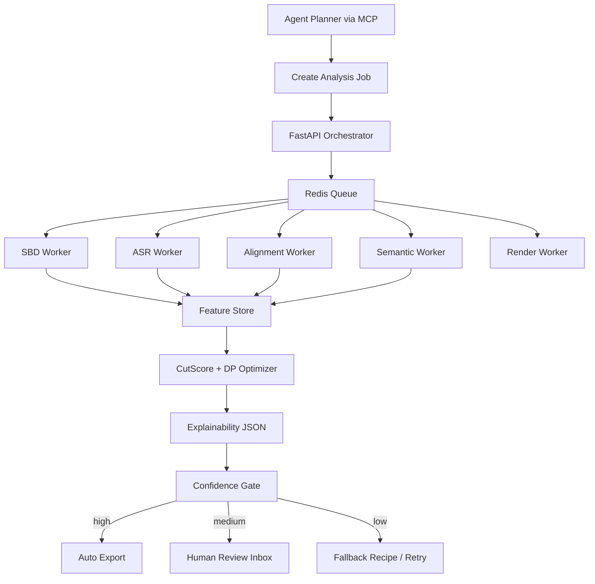

# Produktionsreifer Auto-Shorts-Cutter für agentische Vollautomatisierung

## Executive Summary

Du willst keinen „Auto-Cutter“, der nur stille Stellen trimmt, sondern ein System, das **visuelle Schnitte robust erkennt, Wort- und Phonemgrenzen respektiert, akustisch unauffällige Übergänge baut, semantisch kohärente Shorts auswählt und dann sauber in verschiedene Formate exportiert**. Genau dafür ist die richtige Architektur **nicht** ein einzelnes Modell, sondern eine **mehrstufige multimodale Optimierung**:  
**visuelle Kandidatenfenster** aus Shot/Scene Detection, **audio- und alignment-sichere Feinkorrektur** über VAD + Forced Alignment, **semantische Segmentwahl** über Embeddings/Hook-Erkennung, und am Ende **globale Segmentoptimierung** per Dynamic Programming oder Graph Search. Diese Richtung ist konsistent mit dem von dir hochgeladenen Anforderungsrahmen. fileciteturn0file0 citeturn8academia2turn9academia0turn18academia0turn30view0

Die stärkste praktische Kombination für ein MVP mit echter Produktionschance ist heute:  
**TransNetV2 + PySceneDetect** für visuelle Boundary-Kandidaten, **faster-whisper + WhisperX + Silero VAD** für ASR, Wort-Timestamps und VAD-gestützte Drift-Reduktion, optional **Montreal Forced Aligner** für High-Precision-Realignment bei finalen Exports, dazu **FFmpeg** für frame-genaue Render-Pipelines, Loudness/Transitions/QA und **pyloudnorm bzw. loudnorm** für konsistente Lautheit. **AutoShot** ist forschungsseitig stark, aber als direkter Production-Kern heute weniger attraktiv als TransNetV2 + PySceneDetect, weil Ökosystem, Packaging und Gewichtsverteilung schwächer sind. **VideoCLIP/MMPT** und ähnliche VLM-/retrieval-lastige Stacks sind eher **Semantik-Layer** als Schnittkern; besonders MMPT/VideoCLIP ist zusätzlich durch das archivierte fairseq-Repo und die überwiegend CC-BY-NC-Lizenz im MMPT-Teil als Core-Production-Dependency riskant. citeturn8academia1turn8academia2turn11view0turn14view0turn15view2turn13view0turn8academia0turn7view1turn6view6

Meine klare Empfehlung ist deshalb:  
**Baue zuerst einen deterministischen Hybrid-Cutter**, nicht sofort ein End-to-End-Transformer-Monster. In der Praxis heißt das:  
1. visuelle Shot-Kandidaten erzeugen,  
2. diese an **nicht-destruktive Audio-/Wortgrenzen schnappen**,  
3. jedes mögliche Cut-Fenster mit einem **CutScore** bewerten,  
4. die besten Short-Segmente via **DP / constrained search** auswählen,  
5. abschließend **FFmpeg-basiert rendern, captionen, normalisieren und QA-checken**.  
Das ist sehr viel realistischer als „ein Modell ersetzt Senior Editor komplett“. Für Talking-Head, Podcast, Tutorial, Interview, Faceless explainer und viele Creator-Formate kann es den Großteil des **ersten Edit-Passes** automatisieren; für High-End-Commercials, Comedy timing, stark music-driven pieces und schwierige narrative Montage bleibt Human Review auf absehbare Zeit sinnvoll. Das ist eine technische Inferenz aus aktuellem OSS- und Forschungstand. citeturn21view0turn11view0turn15view4turn8academia0turn16view0turn20academia0

## Mathematische Methoden, die für echte Schnittqualität zählen

Das Kernproblem ist nicht nur **„wo ist ein Shotwechsel?“**, sondern **„wo ist der beste editierbare Cut, der visuell, akustisch, linguistisch und semantisch zugleich stabil ist?“**. Klassische SBD-Methoden bleiben dafür relevant, weil sie billig, interpretierbar und oft robust gegen einzelne Modellfehler sind. PySceneDetect dokumentiert dafür mehrere produktive Familien: **HSV-Content-Differenzen**, **adaptive Rolling-Average Thresholds**, **Histogramm-basierte Schnitte im Y-Kanal**, **Fade-Erkennung über Intensität** und **Perceptual Hashing**. Gerade der adaptive Rolling-Average-Ansatz ist für AI-verzogene Roughcuts wichtig, weil er Fast Motion und globale Helligkeitssprünge besser abfedert als ein starrer Threshold. citeturn11view0

Für deine Problemklasse würde ich die visuellen Features in drei Ebenen trennen.  
Die **erste Ebene** sind **low-level change features**: Histogramm-Differenzen, luma/chroma change, edge change, perceptual hash distance, black/freezedetect-Signale und ggf. Optical-Flow-Magnitude. Diese Features sind extrem gut, um „harte Kandidaten“ zu finden und offensichtliche Render-Artefakte, eingefrorene Frames oder schwarze Zwischenbilder zu markieren. FFmpeg hat dafür direkt nutzbare Filter wie `blackdetect` und `freezedetect`, die Metadaten an Frames schreiben und damit ideal für Batch-QA sind. citeturn11view0turn27view3turn27view4

Die **zweite Ebene** sind **temporal-deep SBD-Modelle**. TransNetV2 ist hier praktisch nach wie vor ein sehr guter Default: Das Repo meldet starke Re-Evaluationswerte auf ClipShots, BBC Planet Earth und RAI, und bietet ausdrücklich Inferenzcode für reale Videos an. AutoShot geht noch stärker in Richtung short-video-domäne und berichtet auf dem neu eingeführten SHOT-Datensatz einen Vorsprung gegenüber TransNetV2; gleichzeitig ist der praktische Portierungsaufwand höher und die OSS-Verpackung deutlich rauer. Deshalb ist AutoShot heute eher **Benchmark-/R&D-Comparator** als dein erster Produktionsanker. citeturn2view0turn8academia2turn8academia1turn21view2

Die **dritte Ebene** ist **semantische visuelle Kontinuität**. Hier geht es nicht um Shots, sondern um „steht der Cut inhaltlich stabil?“ Dafür sind **CLIP-/VideoCLIP-artige Features**, ViT-basierte Embeddings oder Highlight-/Moment-Retrieval-Modelle sinnvoll. VideoCLIP zeigt, dass kontrastive Video-Text-Pretraining starke Zero-Shot-Video-Text-Verknüpfung ermöglicht, und Lighthouse bündelt mehrere moderne Moment-/Highlight-Detektoren mit CLIP-Features, QVHighlights und API-Zugang. Für Shorts ist das Gold wert, weil du damit nicht nur „harte Schnitte“ findest, sondern **Hook-relevante Zeitfenster** und **query-kompatible Highlights** priorisieren kannst. Als Produktionsentscheidung würde ich aber **nicht** fairseq/MMPT als schweres zentrales Runtime-Dependency nehmen, weil das übergeordnete fairseq-Repo seit März 2026 archiviert ist und MMPT teilweise CC-BY-NC lizenziert ist. Stattdessen: CLIP-/Video-Embedding-Ideen übernehmen, Semantik-Layer separat kapseln. citeturn9academia1turn18academia0turn16view0turn22view0turn6view6

Audioseitig brauchst du ebenfalls zwei Klassen von Methoden. Die **grobe Klassifikation** kommt von **VAD, Silence und Energy**. Silero VAD ist für Produktivsysteme aktuell extrem attraktiv: laut Repo verarbeitet es 30+ ms Audio auf einem einzelnen CPU-Thread in unter 1 ms, unterstützt 8 kHz und 16 kHz, ist klein und portabel. faster-whisper integriert Silero VAD direkt und entfernt standardmäßig konservativ nur längere Silence-Blöcke; im Batched Inference ist der VAD-Filter standardmäßig aktiv. Für „roughcuts mit transcript drift“ ist genau das wichtig, weil du erst einmal saubere sprachaktive Inseln bekommst, bevor du Worte neu justierst. Zusätzlich lohnt sich einfache DSP wie RMS-Energie, MFCC-/Mel-Distanzen und Spektrogramm-Abstände, weil diese Übergangssprünge erfassen, die VAD allein nicht sieht. Librosa dokumentiert RMS als frameweises Energie-Feature und recurrence/self-similarity-Matrizen für zeitliche Strukturierung. citeturn13view0turn14view1turn26view0turn26view1

Für **transcript-safe cuts** ist Alignment der härteste Teil. WhisperX adressiert genau die typischen Whisper-Probleme bei Long-Form-Audio: Drift, Halluzinationen, ungenaue Segment-Timestamps. Das Paper beschreibt VAD-basiertes Cut-and-Merge plus Forced Phoneme Alignment und berichtet sowohl Qualitätsgewinne als auch starke Beschleunigung bei Long-Form-ASR. Das Repo ergänzt batched large-v2-Inferenz mit Wort-Timestamps, diarization und wav2vec2-basierter Alignment-Stufe. Gleichzeitig zeigt der Vergleich von Rousso et al., dass klassische Forced Alignment mit **Montreal Forced Aligner** auf TIMIT und Buckeye **WhisperX und MMS** in der reinen Alignment-Genauigkeit übertrifft. Praktisch heißt das: **WhisperX für Durchsatz und brauchbare Word-Timestamps, MFA für Final-Pass-Realignment auf high-value Exports oder Goldsets.** citeturn9academia0turn15view2turn8academia0turn24view0

Die eigentliche Magie liegt dann in der **multimodalen Zielfunktion**. Statt „cut at local minimum“ solltest du jeden möglichen Cut in einem kleinen Fenster, z. B. ±400 ms um visuelle oder linguistische Anker, mit einer gewichteten Funktion bewerten:

```text
CutScore(t) =
  + w_v * VisualBoundaryConfidence(t)
  + w_a * AudioTransitionSmoothness(t)
  + w_l * LinguisticSafety(t)
  + w_s * SemanticBoundaryFitness(t)
  + w_f * FaceMotionContinuity(t)
  + w_d * SpeakerContinuity(t)
  - p_word * WordInterruptionPenalty(t)
  - p_jump * AudioJumpPenalty(t)
  - p_face * FaceJumpPenalty(t)
  - p_ctx  * ContextBreakPenalty(t)
```

Sinnvoll ist dabei eine **zweistufige Normalisierung**: erst robust pro Featurefamilie, etwa per Median/MAD oder Quantilen, dann kalibrierst du die Gewichte entweder heuristisch oder lernst sie über ein Ranking-/Pairwise-Loss. Die globale Segmentwahl machst du anschließend **nicht greedy**, sondern via **DP / shortest path auf einem DAG**, damit Mindest-/Maximaldauer, Hook-Abdeckung, Sprecherkontinuität und „nicht mitten im Wort schneiden“ gemeinsam optimiert werden. Diese Konstruktion ist näher an professioneller Edit-Logik als ein einzelner lokalen Score. Die Validität dieser Richtung wird indirekt durch moderne Moment-/Highlight-Arbeiten wie QVHighlights, MH-DETR und Lighthouse gestützt, die ebenfalls zeitliche Segmente über mehr als nur lokale Relevanz modellieren. citeturn18academia0turn19academia3turn16view0

## Open-Source Stack, der heute wirklich Sinn ergibt

Die folgende Auswahl ist auf **Produktionsreife, aktive Nutzbarkeit und Engineering-Effizienz** optimiert, nicht nur auf Paper-Schönheit.

### Priorisierte OSS-Empfehlung

| Priorität | Repo | Rolle im System | Warum nehmen | Vorsicht |
|---|---|---|---|---|
| Sehr hoch | **PySceneDetect** | schnelle klassische SBD, Fades, adaptive thresholds | mature CLI/Lib, aktive Releases, gute Interpretierbarkeit citeturn4view4 | allein nicht genug bei AI-verzogenen Roughcuts |
| Sehr hoch | **TransNetV2** | deep shot candidate generator | starker praktischer Default für SBD citeturn2view0turn21view0 | eher Research-Repo als polished product package |
| Sehr hoch | **faster-whisper** | schnelle ASR-Inferenz | sehr schneller Whisper-Back-end mit VAD-Integration citeturn5view0turn14view1 | reine Word-Timestamps sind nicht genug für Final-Cuts |
| Sehr hoch | **WhisperX** | Wort-/Satz-Timestamps, diarization, alignment | direkt auf dein Transcript-Drift-Problem passend citeturn15view2turn9academia0 | Alignment hängt von Sprachmodell und Audioqualität ab |
| Hoch | **Silero VAD** | robuste speech regions | klein, schnell, CPU-tauglich citeturn13view0 | nicht als alleinige Cut-Entscheidung verwenden |
| Hoch | **Montreal Forced Aligner** | Final-pass forced alignment | höhere Alignment-Präzision als WhisperX in Benchmark-Vergleich citeturn8academia0turn24view0 | schwergewichtiger Workflow als WhisperX |
| Mittel | **Lighthouse** | Hook-/Highlight-/Moment-Scoring | guter Semantik-Layer mit QVHighlights/Highlight-Detektion citeturn16view0 | eher Ranking-Layer, nicht Core Editor |
| Mittel | **OpenAI CLIP** | Bild-/Text-Semantikfeatures | stabile Basis für Embeddings/visual hooks citeturn21view5turn6view9 | nur image-text; Video braucht Temporal Layer |
| Forschungsmodus | **AutoShot** | Research comparator für short-video SBD | short-form-orientiert, sehr gute Paper-Leistung citeturn8academia1 | Packaging/weights weniger production-ready |
| Forschungsmodus | **VideoCLIP / MMPT** | tiefer video-text semantic layer | starkes Konzept für multimodale Suche citeturn9academia1turn21view8 | fairseq archiviert, MMPT teils CC-BY-NC citeturn22view0turn6view6 |

### Repo-Vergleich

| Repo | Stars | Sprache | Reifegrad | Wichtige Module / Stärken | Lizenz | Install / Run Notes | Quelle |
|---|---:|---|---|---|---|---|---|
| TransNetV2 | 971 | Python | solide Research-Basis | `inference`, `inference-pytorch`, `training`; explizite Inferenz-Readmes citeturn2view0turn21view0 | MIT | kein klassischer PyPI-first flow; Repo-Inferenz nutzen | citeturn2view0 |
| AutoShot | 240 | Python | eher Paper-Repo | NAS-basierte SBD für Short-Videos; Paper + Supplement + Pickle/Script-Assets | MIT | Gewichte laut README via externer Baidu-Link; weniger bequem für CI/CD citeturn21view2turn4view0 | citeturn3view0turn4view1 |
| PySceneDetect | 5k | Python | sehr reif | `scenedetect`, `docs`, `tests`; Content/Adaptive/Threshold/Histogram/Hash | BSD-3-Clause | `pip install scenedetect`; FFmpeg/mkvmerge für splitting empfohlen; v0.7 Release vom 3. Mai 2026 citeturn4view4 | citeturn3view1turn4view5 |
| WhisperX | 22.6k | Python | produktiv nutzbar, aber dynamisch | `whisperx`, `tests`; Wort-Timestamps, diarization, wav2vec2 alignment | BSD-2-Clause | `pip install whisperx`; für diarization HF token nötig; CUDA 12.8 für GPU-Setup im README citeturn15view3turn15view4 | citeturn3view2turn4view2turn4view3 |
| faster-whisper | 23.8k | Python | sehr reif | `faster_whisper`, Benchmarks, Docker, Tests | MIT | `pip install faster-whisper`; nutzt PyAV statt System-FFmpeg; Silero-VAD integriert; Batch-VAD default on citeturn5view0turn14view0 | citeturn6view0turn6view1 |
| Silero VAD | 9.4k | Python/Jupyter | sehr reif | `src/silero_vad`, ONNX/PyTorch, viele Deploy-Beispiele | MIT | `pip install silero-vad`; 30+ ms Chunk <1 ms CPU laut README citeturn13view0 | citeturn6view2turn6view3 |
| Montreal Forced Aligner | 1.8k | Python | sehr reif für Alignment | `montreal_forced_aligner`, Dockerfile, Docs, Tests | MIT | bevorzugt via Conda/Mamba; Kaldi kommt über conda-forge mit citeturn24view0 | citeturn7view0turn6view5 |
| VideoCLIP via fairseq/MMPT | 32.2k auf fairseq | Python | Forschung, production-risky | `examples/MMPT`, `mmpt/models`, `processors`, VideoCLIP configs | fairseq MIT, MMPT überwiegend CC-BY-NC citeturn6view6 | `pip install -e .` in fairseq und dann `examples/MMPT`; Repo archiviert seit 20. März 2026 citeturn22view0 | citeturn21view7turn21view8turn23view0 |
| OpenAI CLIP | 33.8k | Jupyter/Python | sehr reif als Base repo | `clip`, notebooks, schnelle Embedding-Basis | MIT | `pip install ftfy regex tqdm` und `pip install git+https://github.com/openai/CLIP.git` citeturn21view5 | citeturn6view8turn6view9 |
| Lighthouse | 257 | Python | jung, aber sauber | MR/HD-API, Gradio, Training/Eval, QVHighlights/TVSum/YouTube Highlight | Apache-2.0 | CPU/GPU Inference möglich; `clip_slowfast` auf CPU langsam; max Video 150 s im aktuellen Benchmark-Setup citeturn16view0turn17view0 | citeturn16view0turn17view0 |

Kurz gesagt:  
**TransNetV2 + PySceneDetect + WhisperX + faster-whisper + Silero + FFmpeg** ist dein produktiver Kern. **MFA** kommt dazu, wenn du Transcript-Safety wirklich ernst meinst und finale Deliverables nicht nur „gut genug“, sondern editorisch belastbar sein sollen. **Lighthouse/CLIP** würde ich erst dann aktivieren, wenn der Basiscutter stabil läuft und du „welche Shorts sind semantisch am stärksten?“ automatisieren willst. citeturn2view0turn11view0turn15view2turn14view0turn13view0turn16view0

## Empfohlene Architektur für MVP und für die volle Ausbaustufe

Für dein Setup mit **FastAPI, Redis, Supabase, Qdrant, n8n, MCP-Tools und Agent-Orchestrierung** ist die sauberste Trennung:  
**deterministische Medien-Pipeline unten, agentische Planungs-/Entscheidungsschicht oben**. Der Agent sollte **nie** direkt Frame- oder Audio-Manipulationen „ausdenken“, sondern nur wohldefinierte MCP-Tools aufrufen, die deterministisch und reproduzierbar sind. Das reduziert Halluzinationen, verbessert Explainability und hält Renderjobs reproduzierbar. Diese Empfehlung ist eine Engineering-Synthese auf Basis der aktuellen OSS-Landschaft und deiner Anforderungen. fileciteturn0file0 citeturn11view0turn15view4turn16view0

### MVP-Architektur


**MVP-Komponenten** würde ich so setzen:  
- **Frame/audio extraction:** FFmpeg.  
- **Visual candidates:** TransNetV2 plus PySceneDetect Adaptive/Content/Fade.  
- **ASR:** faster-whisper.  
- **Alignment:** WhisperX.  
- **VAD:** Silero, optional zusätzlich FFmpeg `silencedetect`.  
- **Selection:** heuristischer CutScore + DP.  
- **Exports:** FFmpeg mit templates für 9:16, 1:1, 16:9, ASS/SRT captions, loudnorm.  
- **Storage:** Original + proxies in object storage, states/events in Supabase/Postgres, embeddings in Qdrant.  
- **Orchestrierung:** FastAPI API + Redis queue + worker pods; n8n nur für business workflows, Benachrichtigungen, Publishing und fallback approvals.  
Diese Auswahl ist kompatibel mit den dokumentierten Stärken der einzelnen OSS-Bausteine. citeturn14view0turn15view3turn13view0turn30view0turn27view0

Ein sinnvolles Datenmodell in Supabase besteht aus: `assets`, `shot_boundaries`, `word_alignments`, `candidate_windows`, `short_variants`, `qa_events`, `export_jobs`, `human_reviews`. In Qdrant speicherst du nicht rohe Frames, sondern **segment-level embeddings**: Hook-Text, Short-Beschreibung, Title-Ideen, Segment-Embeddings, Face-presence, speaker-ID, emotion/prosody summary. Damit kann dein Agent später queries wie „finde die härtesten Opening Hooks mit derselben Person, ohne Satzabbrüche“ beantworten, ohne jedes Mal das Video neu zu analysieren. Das ist eine Architektur-Inferenz, die aber genau auf die vorhandenen semantischen Tools wie CLIP, QVHighlights/Lighthouse und Chaptering-Literatur einzahlt. citeturn16view0turn18academia0turn20academia0

### Ausbaustufe für echte Editor-Qualität



Die **Advanced-Version** ergänzt vier Dinge.  
Erstens einen **Feature Store**, damit du dieselben Frame-, Audio-, Word- und Embedding-Features nicht zigmal berechnest. Zweitens einen **mehrstufigen Optimizer**, der erst Boundary-Kandidaten generiert und dann Segmentfolgen auswählt. Drittens ein **Confidence Gate** mit Explainability-JSON, damit der Agent begründen kann, warum er exakt diesen Schnitt gesetzt hat. Viertens einen **Review-Inbox-Mechanismus** für medium-confidence Fälle statt „alles oder nichts“. Gerade bei Creator-Workflows ist das wichtig: 80 % Vollautomatik, 15 % one-click approve/edit, 5 % manuell. Die technische Grundlage dafür liefern die aktuellen OSSs, die jeweils gute Teilprobleme lösen, aber nicht das Gesamtproblem end-to-end. citeturn11view0turn15view4turn18academia0turn16view0

Für GPU/Latency gilt ohne weitere Vorgabe von dir: **keine spezifische Constraint**. Praktisch würde ich aber unterscheiden:  
- **Batch mode** für Backlog und Massenproduktion.  
- **Near-interactive mode** für einzelne Shorts mit Proxy-Frames, 16 kHz Audio und reduzierter Suchbreite.  
faster-whisper dokumentiert klare Geschwindigkeits-/VRAM-Vorteile, WhisperX läuft für large-v2 mit <8 GB GPU laut Repo, und Silero ist CPU-günstig. Das spricht stark für einen Split in **CPU-first orchestration + selective GPU acceleration**. citeturn5view0turn15view1turn13view0

## Konkrete Algorithmen für CutScore und Segmentwahl

Die wichtigste Produktentscheidung ist: **Schnittkandidaten nicht framegenau über das ganze Video optimieren**, sondern erst **kandidatenbasierte Fenster** bauen. Das reduziert die Suche massiv und macht das System kontrollierbar.

### Candidate Window Generation

Praktisch würde ich Kandidaten aus fünf Quellen vereinen:  
1. visuelle Peaks aus TransNetV2,  
2. klassische Peaks aus PySceneDetect Content/Adaptive/Histogram/Threshold,  
3. sentence/phrase ends aus WhisperX,  
4. lokale speech-gap-Ränder aus Silero/faster-whisper-VAD,  
5. semantische Hook-/Topic-Shift-States aus Embeddings.  
Danach merge-st du alle Ereignisse, clustert sie in einem kleinen Zeitradius, z. B. 150–300 ms, und erzeugst pro Cluster ein Suchfenster von etwa ±400 ms. Damit muss das Endsystem nur an wenigen Stellen wirklich „fein schneiden“. citeturn11view0turn15view2turn14view1turn16view0

### Feature-Set für jeden Kandidaten

| Featuregruppe | Konkrete Features | Nutzen |
|---|---|---|
| Visuell low-level | HSV delta, Y-hist diff, pHash distance, edge delta, black/freezedetect flags | harte Übergänge, Artefakte, Freeze/Black QA |
| Visuell learned | TransNetV2/AutoShot boundary confidence | robuste Shot-Boundary-Wahrscheinlichkeit |
| Audio energy | RMS slope, local energy step, spectral flux, MFCC distance | akustisch unauffälliger Cut |
| Speech/VAD | speech-to-silence edge, local pause length, speech density | Cuts nicht in aktive Silben hinein |
| Alignment | distance to word end, phoneme end, sentence end | transcript-safe cuts |
| Semantik | topic shift, CLIP/video-text relevance, hook score | Shorts bleiben kohärent |
| Face/motion | face bbox IoU across cut, mouth motion continuity, motion magnitude step | Talking-head Cuts natürlicher |
| Speaker | diarization continuity, speaker switch prior | Sprecherwechsel intelligent nutzen |

Diese Featureliste ist kein „Paper-Zitat“, sondern die sinnvollste operative Zusammenführung der betrachteten Methoden. Die zugrunde liegenden Bausteine sind aber direkt durch die Dokumentation und Papers von PySceneDetect, WhisperX, Silero, VideoCLIP/Lighthouse und den SBD-Papers gedeckt. citeturn11view0turn9academia0turn13view0turn9academia1turn16view0

### Ein belastbares CutScore-Schema

```python
def cut_score(cand, weights):
    # all features already normalized to robust z-scores or [0,1]
    visual = (
        0.55 * cand.transnet_conf +
        0.15 * cand.adaptive_peak +
        0.10 * cand.hist_peak +
        0.10 * cand.hash_jump +
        0.10 * cand.freeze_or_black_bonus
    )

    audio = (
        0.35 * cand.pause_bonus +
        0.25 * cand.rms_smoothness +
        0.20 * cand.mfcc_smoothness +
        0.20 * cand.prosody_boundary
    )

    linguistic = (
        0.40 * cand.word_end_proximity +
        0.35 * cand.phoneme_end_proximity +
        0.25 * cand.sentence_end_proximity
    )

    semantic = (
        0.45 * cand.topic_boundary +
        0.35 * cand.hook_score +
        0.20 * cand.segment_relevance
    )

    continuity_penalty = (
        0.45 * cand.word_interrupt_penalty +
        0.25 * cand.audio_jump_penalty +
        0.20 * cand.face_jump_penalty +
        0.10 * cand.motion_discontinuity_penalty
    )

    return (
        weights["visual"] * visual +
        weights["audio"] * audio +
        weights["ling"] * linguistic +
        weights["semantic"] * semantic -
        weights["penalty"] * continuity_penalty
    )
```

Heuristisch initialisieren würde ich die Gewichte so:  
**visual 0.30, audio 0.25, linguistic 0.25, semantic 0.20, penalty 1.00**.  
Warum? Weil dein explizites Problem aus **schlechten Bildübergängen plus Transcript Drift** besteht. Das heißt: reine Visual-Optimierung wäre zu aggressiv, reine Transcript-Optimierung würde unschöne Schnitte erzeugen. Audio und Alignment müssen ungefährt gleich stark gegen Visual SBD spielen. Das ist eine Systemsynthese aus deiner Zielstellung plus den dokumentierten Eigenschaften von WhisperX, MFA und SBD-Methoden. fileciteturn0file0 citeturn9academia0turn8academia0turn8academia2

### Segment Selection über Dynamic Programming

Für den Übergang von guten Cuts zu guten **Shorts** braucht es globale Optimierung.

```python
def select_shorts(candidate_segments, min_len, max_len, budget_k):
    # candidate_segments: precomputed [start, end, cut_quality, semantic_quality, penalties...]

    # dp[i][k] = best score ending at segment i using k segments
    dp = {}
    back = {}

    for i, seg in enumerate(candidate_segments):
        if min_len <= seg.duration <= max_len:
            dp[(i, 1)] = seg.total_score
            back[(i, 1)] = None

    for k in range(2, budget_k + 1):
        for i, seg_i in enumerate(candidate_segments):
            best = None
            best_prev = None
            for j, seg_j in enumerate(candidate_segments):
                if seg_j.end <= seg_i.start:  # non-overlap / valid order
                    transition = segment_transition_score(seg_j, seg_i)
                    score = dp.get((j, k - 1), float("-inf")) + seg_i.total_score + transition
                    if best is None or score > best:
                        best = score
                        best_prev = j
            if best is not None:
                dp[(i, k)] = best
                back[(i, k)] = best_prev

    return traceback_best(dp, back)
```

Die Transition-Strafe sollte enthalten:  
- wiederholte Hook-Semantik vermeiden,  
- Sprecherchaos vermeiden,  
- zu viele sehr kurze Mikrosequenzen vermeiden,  
- harte Lautheitssprünge vermeiden,  
- visuelle crop-instability vermeiden.  

Wenn du nur einen einzelnen Short erzeugst, kannst du das noch einfacher als **weighted interval scheduling** formulieren. Wenn du mehrere Varianten exportierst, lohnt sich zusätzlich ein **diversity penalty**, damit Variante B nicht nur 95 % von Variante A repliziert. Moderne Highlight-Detektion und query-based moment retrieval legen genau diese Richtung nahe: nicht nur lokale Peaks, sondern zeitliche Relevanz + Diversität + Saliency. citeturn18academia0turn19academia3turn16view0

## Exportqualität, QA und Monitoring

Ein Expert-Cutter endet nicht beim Schnitt. Für Creator-Workflows musst du **Mastering, Captioning, Cropping und QA** automatisieren. Im Audioexport würde ich zwei Dinge fest verankern:  
**Crossfades/Fades** für problematische Übergänge und **Loudness-Normalisierung** auf konsistente Zielwerte. FFmpeg dokumentiert `acrossfade` für überlappende Audio-Crossfades, `afade` für kontrollierte Fade-Kurven und `loudnorm` für EBU-R128-konforme Loudness-Normalisierung inkl. Single- und Double-Pass. `pyloudnorm` implementiert zusätzlich ITU-R BS.1770-4 in Python und eignet sich gut für Vorabmessung, Monitoring und Tests. citeturn27view1turn27view2turn30view0turn28view0

Für Captions ist der richtige Workflow fast nie „ein Word = eine Subtitle-Zeile“. WhisperX nennt selbst sentence-level segmentation als Verbesserungsrichtung für subtitling. Praktisch würde ich daher **Alignment auf Wortebene berechnen**, aber **Caption Rendering auf phrase-/sentence-Ebene** machen, mit harten Regeln: max Zeichen pro Zeile, max two-line block, semantic phrase integrity, keine Zeilenumbrüche mitten in Namen oder Zahlen. Wort-Daten bleiben trotzdem wertvoll für Karaoke-/Highlight-Effekte und für den transcript-safe Snap der Cuts. citeturn15view4turn15view2

Für Bildexport in 9:16, 1:1 und 16:9 brauchst du **shot-aware reframing** statt center-crop. Minimum ist face-aware crop mit Bewegungsglättung; besser ist ein Crop-Controller, der Prioritäten aus **face box**, **mouth activity**, **screen text**, **primary object** und **semantic relevance** kombiniert. Hier reichen für MVP klassische CV-Heuristiken plus Glättung oft weiter als ein teures VLM. Wenn du später semantisch intelligente Reframings willst, kannst du CLIP-/Highlight-Features ergänzen. Das ist bewusst eine pragmatische Empfehlung: zuerst stabile Geometrie, dann fancy semantics. Unterstützende Grundlage dafür liefern CLIP/Lighthouse zwar auf Semantikseite, aber nicht als fertige Reframing-Engine. citeturn16view0turn6view9

Automatisierte QA sollte mindestens diese Checks enthalten:  
- **SBD sanity:** kein Export beginnt/endet auf Black- oder Freeze-Frames.  
- **Audio sanity:** keine harten Silent Holes außer gewollt, Loudness im Zielband.  
- **Caption sanity:** keine unterbrochenen Wörter, keine negativen Timestamps, keine Overlaps.  
- **Crop sanity:** bbox außerhalb Safe Area nur unter Schwellwert.  
- **Drift sanity:** mittlerer Alignment Error gegenüber Final-Audio unter internem Zielwert.  
FFmpeg liefert dir bereits Metadaten-Filter für `blackdetect`, `freezedetect`, `silencedetect`; Loudness kann mit `loudnorm` oder `pyloudnorm` geprüft werden. citeturn27view3turn27view4turn27view0turn30view0turn28view0

Für CI/QA würde ich einen festen **golden-set harness** aufbauen. Nicht nur Unit Tests, sondern echte Medien-Regressionen. Konkret:  
- 30–50 problematische creator videos mit manuell kuratierten Ideal-Cuts,  
- 10–20 AI-verzogene Roughcuts,  
- 5–10 multilingual / code-switching tracks,  
- 5–10 Fälle mit starker Kamera-/Kopfbewegung,  
- 5–10 Fälle mit bewusst schlechten Audioübergängen.  

Jeder Commit rendert Proxies, berechnet Scores und vergleicht gegen Baselines: **cut F1**, **boundary offset**, **word interruption rate**, **audio jump score**, **mean semantic relevance**, **export failure rate**. Das ist keine Literaturvorgabe, sondern genau die Form von Regression-Testing, die ein professioneller Auto-Editor braucht.

## Evaluation, Datensätze, Risiken und Agentensteuerung

Für die Evaluierung solltest du **nicht einen einzigen Datensatz** benutzen. Für visuelle Boundary-Qualität sind **SHOT**, **ClipShots**, **BBC** und **RAI** relevant, weil genau diese Benchmarks in den TransNetV2- und AutoShot-Arbeiten/Repos verwendet werden. Für Alignment ist der Vergleich mit **TIMIT** und **Buckeye** aus der aktuellen Forced-Alignment-Literatur wichtig. Für semantische Highlight-/Moment-Auswahl ist **QVHighlights** aktuell der wichtigste offene Referenzpunkt; Lighthouse integriert zusätzlich klassische Highlight-/Summarization-Datasets wie TVSum und YouTube Highlight in seinem reproduzierbaren Toolkit. citeturn8academia1turn2view0turn8academia0turn18academia0turn17view0

Ich würde Metriken in vier Schichten aufbauen:

| Ebene | Primärmetriken | Bedeutung |
|---|---|---|
| Boundary | Precision / Recall / F1, hard-vs-gradual getrennt, boundary offset in Frames | erkennt das System visuell korrekt? |
| Transcript safety | word interruption rate, phoneme interruption rate, alignment MAE | kaputtgeschnittene Sprache vermeiden |
| Perceptual transitions | RMS step, MFCC jump, loudness delta, freeze/black hit rate | klingt/sieht der Cut unauffällig aus? |
| Short quality | hook retention, semantic coherence, QVHighlights-style saliency / moment overlap, CTR/Audience retention online | ist der Short inhaltlich gut? |

Die erste und zweite Ebene müssen offline exzellent sein, bevor du Online-Metriken wie CTR oder Retention ernst nimmst. Sonst optimierst du Plattformnoise statt Editqualität. Die Forschungsbasis dafür liefern SBD-Benchmarks, Alignment-Benchmarks und Query-based Highlight-Datensätze; die Online-Metriken sind dann dein Produktlayer obendrauf. citeturn8academia1turn8academia2turn8academia0turn18academia0

Der größte Implementierungsfehler wäre zu glauben, dass ein LLM-Agent selbst editorische Präzision erzeugt. Er sollte nur drei Dinge tun:  
**planen**, **parameterisieren**, **entscheiden unter Konfidenzregeln**.  
Alles Frame-/Sample-genaue muss von deterministischen Tools kommen. Gute MCP-Tools dafür wären:  
`analyze_video`, `generate_cut_candidates`, `score_short_variants`, `render_short`, `run_export_qa`, `request_human_review`, `explain_decision`.  
Jedes Tool sollte ein **Explainability-Payload** zurückgeben: verwendete Features, Top-Penalties, Gründe für Fallback, Confidence. So kann dein Agent später sagen: „Cut bei 02:31.48 gewählt, weil sentence_end + local_pause + stable_face + low audio jump; Alternativkandidat verworfen wegen word interruption“. Das ist genau die Art von agentischer Kontrolle, die in einer MCP-/FastAPI-/Redis-Architektur robust funktioniert. fileciteturn0file0

Risiken und Gegenmaßnahmen würde ich so einordnen:

| Risiko | Warum kritisch | Gegenmaßnahme |
|---|---|---|
| Transcript drift bleibt trotz WhisperX | schlechte Roughcuts, Musik, Overlap Speech | MFA Final Pass für high-value exports; Drift-Alarm bei Alignment-Error |
| Visuelle False Positives bei AI-Artefakten | Optical tricks, morphing, freeze-like motion | Hybrid aus deep SBD + classical detectors + QA blacklist |
| Unsichtbar schlechte Audio-Cuts | Wortende okay, aber Atmer/ambient springt | RMS/MFCC/prosody penalties + short acrossfades |
| Semantisch gute, aber editorisch schlechte Shorts | Hook-Modelle ignorieren Timing | DP mit continuity penalties statt reiner highlight ranking |
| Agent trifft selbstsichere schlechte Entscheidungen | LLM halluziniert Constraints | Confidence Gate + deterministic tool outputs + HITL fallback |
| Lizenz-/Produktionsrisiko bei Forschungsrepos | archiviert, NC-Lizenz, externe Gewichte | Forschungsrepos nur als offline comparator, nicht als core dependency |

Diese Risiken folgen direkt aus der aktuell verfügbaren OSS-Lage: sehr gute Teilkomponenten, aber viel Glue-Code und kaum ein einziges Repo, das „professional video editor replacement“ wirklich End-to-End abdeckt. citeturn22view0turn6view6turn21view2turn15view4

Zum Thema **Voice Repair / Voice Cloning**: Wenn du kaputte Roughcuts akustisch „unsichtbar“ machen willst, ist der sichere Pfad zuerst **Alignment + transition smoothing + selective re-synthesis nur für Mini-Lücken**. Vollständige Voice-Cloning-Workflows würde ich nur für **eigene Stimme oder klar lizenzierte Sprecherstimmen mit expliziter Einwilligung** einsetzen. Technisch ist es verlockend, rechtlich und reputational aber riskant, sobald Identitätstäuschung oder ungeklärte Nutzungsrechte im Spiel sind. Die konkrete Rechtslage ist jurisdiktionsabhängig; als Produktpolicy sollte dein System hier konservativ sein.

Mein Bottom Line für dein Ziel lautet daher:  
**Die beste Option ist ein hybrider Multimodal-Cutter mit deterministischen Medien-Tools und lernbasiertem Scoring, nicht ein monolithisches End-to-End-Modell.**  
Wenn du dieses System in VibeMind-artiger Architektur baust, würde ich die Reihenfolge so setzen:  
**MVP:** PySceneDetect + TransNetV2 + faster-whisper + WhisperX + FFmpeg.  
**Stabilisierung:** MFA, loudnorm/pyloudnorm, golden-set QA, confidence/HITL.  
**Upgrade:** CLIP/Lighthouse/Chaptering/semantic ranking, speaker- und face-aware reframing, diversity-aware multi-variant generation.  
Das gibt dir die realistischste Route zu einem Auto-Editor, der in vielen Creator-Setups tatsächlich professionelle Cutter **teilweise** ersetzen kann und in einigen standardisierten Formaten sogar **weitgehend**. citeturn11view0turn8academia2turn14view0turn15view2turn24view0turn16view0turn20academia0