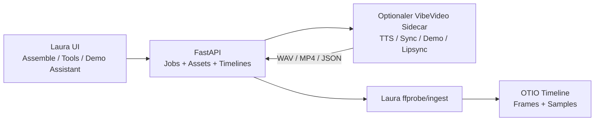

# VibeVideo -> Laura Integration (Design)

## Ziel

Laura soll die sinnvollen Teile aus `Flissel/vibevideo` und `Flissel/vibevideo-deepfake`
integrieren, ohne den frame-/sample-genauen Kern oder den local-first Startpfad zu verwässern.
Die Integration wird in fünf Slices gebaut:

1. **VV1 Audio-Lane** als Fundament.
2. **VV2 Voiceover/TTS** fuer echte Stimm-Neugenerierung.
3. **VV3 Sync Guard** fuer Export- und Sidecar-Drift.
4. **VV4 Product-Demo Assistant** fuer Screenrecording -> Sequenz-Draft.
5. **VV5 Lipsync/Deepfake** als spaeter, consent-pflichtiger Sidecar.

Nicht-Ziel: VibeVideo-Code direkt in Lauras Kern kopieren oder MoviePy-Sekunden als
Projektzustand speichern.

## Leitprinzipien

- Laura speichert Timeline-Zustand weiterhin in Ganzzahl-Frames und Audio in Samples.
- VibeVideo-Funktionen laufen als optionale Sidecars/Adapter. Fehlt ein Sidecar, startet Laura
  trotzdem vollstaendig.
- Synthetische Outputs werden immer als Assets registriert, neu geprobt und mit `synthetic=true`,
  `ai_effect`, Source-Range und, falls Identitaet/Stimme betroffen ist, Consent-ID markiert.
- `vibevideo` ist MIT und kann als technische Referenz dienen. `vibevideo-deepfake` ist laut
  Lizenz proprietaer/vertraulich; Nutzung nur ueber private Sidecar-/Adapter-Freigabe.

## Architektur

Der Sidecar darf intern eigene Bibliotheken und Sekundenlogik verwenden. Die Grenze zu Laura ist
aber strikt: Input enthaelt Asset-IDs, Frame-Ranges, Sample-Ranges, Text und Parameter; Output ist
eine Mediendatei oder ein JSON-Draft, der in Lauras kanonisches Modell uebersetzt wird.

## VV1 — Audio-Lane

Laura bekommt eine echte A2-Spur fuer Voiceover/Musik. Das ist Voraussetzung fuer TTS, weil eine
generierte Stimme sonst nicht sinnvoll im Schnitt liegt.

Backend:

- Audio-Overlay-Clips mit Sample-genauer Platzierung.
- Mix-Modi: `mix`, `replace_original`, `mute_original`.
- Gain pro Clip/Spur, einfache Fade-in/out.
- Export-Mix im bestehenden Renderpfad.

Frontend:

- A2-Spur in Assemble sichtbar.
- Clip-Lautstaerke, Mute/Replace/Mix, Fade-Werte.
- Keine TTS-UI in VV1, nur Audio-Platzierung.

## VV2 — Voiceover/TTS

Neuer Flow: `Stimme erzeugen` ist getrennt von `Speichern + neu ausrichten`.

Backend:

- `VoiceoverBackend` Protocol mit `Unavailable`, `Stub`, `Sidecar`.
- Job `ai.voiceover`.
- Input: Text aus Transcript-Segment oder freier Voiceover-Block, Zielrange, Sprache,
  Reference-Audio/Voice-ID.
- Output: WAV-Asset, synthetisch markiert, auf A2 platziert.
- Bei Personenstimmen: Consent-Record Pflicht.

Frontend:

- Im Transcript-Panel oder Tools-Tab: `Stimme erzeugen`.
- Status zeigt: Sidecar fehlt, Consent fehlt, Job laeuft, WAV erzeugt, auf A2 platziert.
- Textkorrektur bleibt auch ohne TTS weiter nutzbar.

## VV3 — Sync Guard

Aus `vibevideo-deepfake/lipsync/sync_guard.py` wird ein Laura-kompatibles Konzept uebernommen:
Video-Framecount ist Ground Truth; Audio wird gemessen, getrimmt oder gepadded.

Backend:

- Export-/Sidecar-Preflight berechnet Video-Dauer aus Frames und FPS.
- Audio-Dauer wird in Samples gemessen.
- Ergebnis: `is_synced`, `delta_ms`, `video_frames`, `audio_samples`.
- Optionaler Fix erzeugt korrigiertes Audio/MP4, ohne Timeline-Zustand in Sekunden zu speichern.

Frontend:

- Job-/Export-Zentrale zeigt Sync-Warnungen anklickbar.
- Optionaler Button: `Audio-Dauer korrigieren`.

## VV4 — Product-Demo Assistant

Aus `vibevideo/product/demo_video.py` wird nicht der MoviePy-Build importiert, sondern das Produktmuster:
Screenrecording analysieren, Szenen/Labels/Voiceovertexte vorschlagen, User kuratiert, Laura baut
die Sequenz.

Backend:

- `demo.analyze` Job fuer Screenrecordings.
- Outputs: Draft-JSON mit Szenen, Labels, Voiceovertext, Ziel-Dauer, Thumbnail/Frame-Refs.
- Optionaler Vision-Schritt mit API-Key; ohne Key fallback auf Szenen/Transcript.

Frontend:

- Demo-Assistent: Vorschlaege annehmen/ablehnen, Text editieren, Ziel-Dauer anpassen.
- Uebernahme schreibt normale Laura-Sequenz + optional Voiceover-Blöcke.

## VV5 — Lipsync/Deepfake

Letzter Slice, weil er schwere Modelle, Consent, Lizenzfreigabe und Qualitaetskontrolle braucht.

Backend:

- `ai.lipsync` Sidecar.
- Consent-Record, Face-/Mouth-Probe vor dem Job.
- Output als synthetisches MP4-Asset mit Quality-Metriken.
- Qualitaets-Gate aus Mundregion-/Temporal-/Sync-Metriken.

Frontend:

- Nur sichtbar, wenn Sidecar installiert und freigegeben ist.
- Klare Warnungen bei fehlendem Consent, ungeeignetem Portrait/Driving oder schlechtem Quality-Score.

## Fehlerfaelle

- Sidecar fehlt: UI zeigt installierbaren/konfigurierbaren Zustand, kein Backend-Crash.
- API-Key fehlt: nur der betroffene Feature-Pfad ist deaktiviert.
- Consent fehlt oder widerrufen: Job wird vor Sidecar-Aufruf abgelehnt.
- Output-Dauer driftet: Sync Guard markiert Warnung und bietet Fix an.
- Sidecar liefert defektes Medium: Asset wird nicht registriert; Job zeigt Ursache.

## Teststrategie

- Backend Unit-Tests fuer Datenmodell, Mix-Modi, Sidecar-Adapter-Protokolle, Consent-Gates.
- Golden-/ffmpeg-Tests fuer Audio-Mix, Fade, Sync Guard und Export-Dauer.
- Frontend-Tests fuer A2-Spur, Voiceover-Button, Jobstatus, Sidecar-fehlt-Zustand.
- Sidecar-Tests zuerst mit Fake-HTTP-Server; echte Modelle nur gated.
- Keine Tests, die echte API-Keys oder Modell-Downloads voraussetzen.

## Exit-Kriterien

VV1 ist fertig, wenn WAV/Audio-Assets sample-genau auf A2 liegen und im Export hoerbar korrekt
gemischt werden.

VV2 ist fertig, wenn ein geaenderter Transcript-Text optional als neue Stimme erzeugt, als WAV
registriert und auf A2 platziert wird.

VV3 ist fertig, wenn Exporte und Sidecar-Outputs Drift sichtbar melden und optional korrigieren.

VV4 ist fertig, wenn ein Screenrecording zu einem editierbaren Sequenz-Draft mit Labels und
Voiceovertext wird.

VV5 ist fertig, wenn Lipsync nur mit Consent laeuft, synthetisch markiert ist und einen Quality-Score
liefert.

