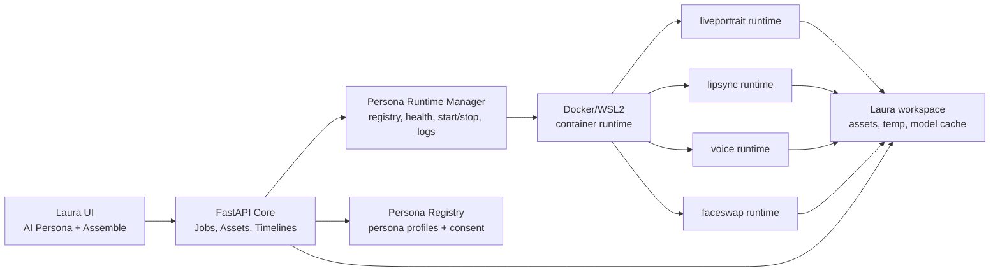

# AI Persona Foundation - Container-first Design

## Ziel

Laura bekommt eine robuste **AI-Persona-Pipeline**, mit der wiederverwendbare Personas erstellt und
in Projekten fuer Reenact, Lipsync, Voice und Face Swap genutzt werden koennen. Die schweren Modelle
laufen nicht im Laura-Kern, sondern als aktiv verwaltete Container-Runtimes. Laura bleibt der
frame-/sample-genaue Schnitt- und Orchestrierungs-Kern.

Erster Produktfokus: **Persona-Fundament**. Danach kann ein Wow-Flow folgen: Script oder Clip-Range
rein, Persona waehlen, Voice/Reenact/Lipsync/Swap ausfuehren, synthetisches Asset oder Reel raus.

## Leitentscheidungen

- **Container-first, nicht container-only.** Produktiver Standard sind Docker/WSL2-Container; fuer
  Entwicklung bleiben `external_http` und `stub` erlaubt.
- **Laura bleibt model-free.** Keine Torch/CUDA/Modell-Imports im FastAPI-Kernprozess.
- **Jede Runtime spricht einen stabilen HTTP-Vertrag.** Laura integriert ueber Health, Capabilities,
  Jobs, Output-Dateien und Metrics.
- **Persona ist ein eigenes Objekt.** Consent, Referenzassets, Stimme, Gesicht, erlaubte Effekte und
  Runtime-Kompatibilitaet werden wiederverwendbar gespeichert.
- **Synthetik ist nie unsichtbar.** Outputs bekommen `synthetic=true`, `ai_effect`, Provenance und
  spaeter C2PA/Video-Seal; sichtbare Kennzeichnung bleibt Export-Option bzw. Policy.
- **Frames/Samples bleiben Wahrheit.** Runtime-Container duerfen intern Sekunden nutzen, aber die
  Grenze zu Laura ist immer Frame-/Sample-basiert.

## Architektur

Der FastAPI-Kern verwaltet Jobs und kanonische Assets. Der Runtime Manager verwaltet Container,
Healthchecks, Capabilities und Logs. Die Container lesen Inputs aus einem gemounteten Workspace-Temp
und schreiben Outputs dort zurueck. Laura probt Outputs neu, prueft Dauer/Sync, registriert sie als
Assets und platziert sie in Timeline- oder Audio-Lanes.

## Runtime-Typen

### `stub`

Immer verfuegbar, dep-frei, erzeugt sichtbar markierte Platzhalter. Nutzt bestehende Testbarkeit und
erlaubt UI/Job-Flows ohne Modellinstallation.

### `external_http`

Ein manuell gestarteter Sidecar. Laura kennt Base-URL, Health und Capabilities, startet den Prozess
aber nicht selbst. Gut fuer Entwicklung und fremde lokale Services.

### `container`

Produktiver Standard. Laura kennt Image, Container-Name, Port, GPU-Anforderung, Volumes und
Environment. Der Runtime Manager kann starten, stoppen, Logs lesen, Health pruefen und Capabilities
cachen.

## Runtime-Vertrag

Jede Runtime implementiert mindestens:

- `GET /healthz` -> `{ "ok": true, "ready": true }`
- `GET /version` -> Runtime-Name, Version, Modellversionen
- `GET /capabilities` -> Effekte, Inputtypen, Outputtypen, GPU-Bedarf, optionale Metrics
- `POST /run` oder ein spezifischer Endpoint wie `/reenact`, `/lipsync`, `/voice`, `/faceswap`

Laura sendet keine DB-IDs als einzige Wahrheit, sondern materialisierte Input-Dateien plus Metadaten:

- `job_id`
- `persona_id`
- `project_id`
- `effect`
- `input_paths`
- `seq_in_frame`, `seq_out_frame_exclusive`
- `fps_num`, `fps_den`
- audio sample rate / sample ranges, wenn relevant
- policy flags: consent id, license acceptance, watermark/disclosure settings

Runtime-Output:

- Mediendatei: MP4/WAV/PNG-Sequenz je Effekt
- JSON sidecar: Runtime-Version, Modellname, Dauer, Frames/Samples, Quality-Metrics, Warnings

Laura akzeptiert Output erst nach:

1. Datei existiert und ist lesbar.
2. ffprobe/audio probe erfolgreich.
3. Sync Guard gegen erwartete Frame-/Sample-Dauer.
4. Quality-Gate pro Effekt.
5. Provenance-Manifest geschrieben.
6. Asset-Registrierung mit `synthetic=true`.

## Container-Runtimes

Vorgesehene Container:

- `laura-runtime-liveportrait`: Reenact / Portrait Animation
- `laura-runtime-lipsync`: Wav2Lip, MuseTalk oder kompatible Lipsync-Modelle
- `laura-runtime-voice`: TTS und Voice Clone
- `laura-runtime-faceswap`: Face Swap / Identity Transfer
- spaeter `laura-runtime-restore`: Upscale, Face Restore, Artifact Cleanup

Container bekommen drei Standard-Volumes:

- `workspace/ai-runtime/io`: kurzlebige Job-Inputs und Outputs
- `workspace/ai-runtime/logs`: Runtime-Logs, pro Container getrennt
- externer Modellcache, z. B. `E:/LauraModels/<runtime>` oder vom User gewaehlter Pfad

GPU-Zugriff wird pro Runtime konfiguriert. Wenn Docker GPU nicht verfuegbar ist, bleibt die Runtime
installiert, aber `ready=false` mit klarer Ursache.

## Datenmodell

Neue Tabellen:

### `ai_runtimes`

- `id`
- `kind`: `stub | external_http | container`
- `effect`: `reenact | lipsync | voice | faceswap | restore`
- `display_name`
- `base_url`
- `container_image`
- `container_name`
- `port`
- `workspace_mount`
- `model_mount`
- `requires_gpu`
- `enabled`
- `license_status`: `unknown | accepted | rejected | not_required`
- `status_cache_json`
- `capabilities_json`
- `last_health_at`
- `created_at`, `updated_at`

### `ai_personas`

- `id`
- `project_id` nullable; null = global/local persona
- `name`
- `consent_id`
- `face_reference_asset_id` nullable
- `voice_reference_asset_id` nullable
- `style_json`
- `allowed_effects_json`
- `created_at`, `updated_at`

### `ai_runtime_events`

- `id`
- `runtime_id`
- `event_type`: `health | start | stop | log | error | setup`
- `level`
- `message`
- `payload_json`
- `created_at`

Bestehende AI-Jobs wechseln schrittweise von `backend` auf `runtime_id`. `backend` bleibt fuer
Rueckwaertskompatibilitaet eine UI-/API-Abkuerzung, die auf eine Runtime aufgeloest wird.

## Setup Assistant

Der Setup Assistant fuehrt pro Runtime durch:

1. Docker/WSL2 verfuegbar?
2. NVIDIA GPU fuer Container verfuegbar?
3. Runtime-Image vorhanden oder Build/Pull moeglich?
4. Modellcache-Pfad gewaehlt?
5. Lizenzhinweis bestaetigt?
6. Runtime registrieren.
7. Container starten.
8. Health und Capabilities lesen.
9. Kleinen Smoke-Job ausfuehren.

Der Assistant darf keine proprietaeren Gewichte stillschweigend laden. Bei gated/proprietaeren
Modellen wird nur der Pfad registriert oder eine manuelle Download-Anleitung angezeigt.

## Persona-Kit

Eine Persona ist kein einzelnes Modell, sondern ein Set aus Referenzen und Policies:

- Name und Beschreibung
- Consent-Record
- Portrait-/Face-Referenzen
- Voice-Referenz oder externe Voice-ID
- erlaubte Effekte: Voice, Reenact, Lipsync, Face Swap
- bevorzugte Runtimes je Effekt
- Disclosure-Policy: sichtbares Label, Provenance, spaeter C2PA

Persona-Erstellung prueft:

- Consent existiert und ist nicht widerrufen.
- Referenzassets gehoeren zum Projekt oder sind globale lokale Assets.
- Mindestens ein Effekt hat eine passende Runtime.
- Optional: Face-/Voice-Quality-Probe.

## Pipeline-Orchestrierung

Langfristiger Pipeline-Run:

1. Input waehlen: Script/Text, Transcript-Block oder Timeline-Range.
2. Persona waehlen.
3. Effektkette waehlen:
   - Voice -> Lipsync
   - Reenact -> Lipsync
   - Face Swap -> Lipsync
   - Voice -> Reenact -> Lipsync -> Reel
4. Laura materialisiert Input-Dateien aus Assets/Timeline-Range.
5. Jobs laufen einzeln und idempotent, jeder Output wird neu geprobt.
6. Finale Outputs landen als A2-Audio, Replace-Overlay, normales Asset oder Reel-Export.

Erste MVP-Kette nach Foundation:

`Persona + Text + Timeline-Range -> Voice WAV -> Lipsync MP4 -> Replace-Overlay`

## Robustheit

- Container-Ausfall killt nicht Laura; Job endet mit strukturierter Ursache.
- Healthchecks laufen mit Timeout und gecachtem Status.
- Runtime-Outputs werden erst nach Probe/Sync/Quality registriert.
- Job-Inputs liegen in isolierten Temp-Verzeichnissen pro Job.
- Start/Stop ist idempotent: bereits laufender Container wird wiederverwendet.
- Ports werden pro Runtime reserviert und Konflikte klar gemeldet.
- Logs werden begrenzt gespeichert, damit Runtime-Spam nicht die DB fuellt.

## Skalierbarkeit

Desktop-MVP:

- ein lokaler Docker Host
- eine GPU
- eine Runtime pro Effekt
- Jobs laufen ueber bestehende Queue-Gruppen

Spaeter serverfaehig:

- mehrere Runtime-Instanzen pro Effekt
- Capability-basiertes Routing
- GPU-Klasse als Scheduling-Kriterium
- Container auf Remote-Hosts ueber denselben HTTP-Vertrag
- Runtime Registry bleibt API-kompatibel

Keine Architekturentscheidung blockiert spaeteres Remote-Scaling, aber der erste Scope bleibt lokal.

## Performance

- Runtime-Container bleiben optional warm, damit Modell-Load nicht jeden Job trifft.
- Inputs/Outputs laufen ueber gemountete Dateien, nicht ueber grosse Base64-Payloads.
- Capabilities und Versionen werden gecacht.
- Healthchecks sind kurz und nicht modellladend.
- Job-Orchestrierung nutzt bestehende CPU/GPU-Queues.
- Sync Guard nutzt Framecount/Samples statt ungenauer Sekunden-Dauer.
- Temp-Outputs koennen nach Asset-Registrierung aufgeraeumt werden.

## UI

Neue Bereiche:

- **AI Persona**: Persona-Liste, Persona erstellen, Referenzen, Consent, erlaubte Effekte.
- **Runtimes**: Status pro Runtime, Setup, Start/Stop, Logs, Capabilities.
- **Pipeline Run**: Persona + Input + Effektkette + Quality/Disclosure.

In Assemble bleibt die UI kompakt:

- Persona auswaehlen
- Range setzen
- Effekt ausfuehren
- Jobstatus und Output-Lane anzeigen

## Fehlerfaelle

- Docker fehlt: Runtime-Setup blockiert, Stub/external_http bleiben moeglich.
- GPU fehlt: GPU-Runtime `installed`, aber nicht `ready`.
- Modellgewichte fehlen: Setup zeigt fehlenden Pfad, Runtime nicht ready.
- Lizenz nicht akzeptiert: Runtime nicht fuer Jobs nutzbar.
- Consent widerrufen: Persona und Jobs werden blockiert.
- Runtime liefert defektes Medium: kein Asset, Jobfehler mit Probe-Ursache.
- Quality unter Threshold: Output bleibt temporaer und wird nicht platziert.

## Teststrategie

- Unit-Tests fuer Runtime Registry, Capability-Mapping, Port-/Statuslogik.
- API-Tests fuer Runtime CRUD, Health Refresh, Start/Stop-Befehle mit gemocktem Docker-Adapter.
- Job-Tests fuer `runtime_id`-Routing und Rueckwaertskompatibilitaet zu `backend`.
- Frontend-Tests fuer Runtime-Status, Setup-Schritte, Persona-Erstellung und blockierte States.
- Fake-HTTP-Runtime fuer End-to-End ohne echte Modelle.
- Container-Smoke-Tests gated, nur wenn Docker/GPU explizit aktiviert sind.

## Exit-Kriterien fuer die Foundation

- Laura kann Runtimes registrieren: `stub`, `external_http`, `container`.
- Container-Runtimes koennen gestartet, gestoppt und gehealthchecked werden.
- UI zeigt Status, Capabilities, Logs und Setup-Fehler.
- Persona-Kit speichert Consent, Referenzen und erlaubte Effekte.
- Bestehende Reenact/Lipsync/Voice-Jobs koennen per `runtime_id` geroutet werden.
- Kein schweres Modell ist Pflicht fuer App-Start, Tests oder Packaging.
- Ein Fake-Container oder Fake-HTTP-Sidecar kann einen Persona-Job end-to-end simulieren.

## Nicht-Ziele im ersten Foundation-Slice

- Keine echten Modellgewichte in Git.
- Kein automatischer Download proprietaerer/gated Modelle.
- Kein Remote-Kubernetes-Orchestrator.
- Kein vollstaendiger Face-Swap-Qualitaetsjudge.
- Kein C2PA/Video-Seal-Embedding; nur Anschlussstelle und bestehende Provenance.

## Empfohlene Umsetzungsslices

1. **Runtime Registry + HTTP Health**: Tabellen, Repos, API, UI-Status, `stub` und `external_http`.
2. **Container Manager**: Docker-Adapter, Start/Stop/Logs, Volumes, Ports, GPU-Checks.
3. **Setup Assistant**: gefuehrte Runtime-Registrierung, Modellpfade, Lizenzstatus, Smoke-Job.
4. **Persona Kit**: Persona-Datenmodell, UI, Consent-Verknuepfung, Effektfreigaben.
5. **Runtime-Routing fuer AI-Jobs**: Reenact/Lipsync/Voice auf `runtime_id` umstellen.
6. **AI Persona Pipeline MVP**: Persona + Text/Range -> Voice -> Lipsync -> Replace-Overlay.
